# Módulo Core (Hodei DSL)

El módulo core contiene el modelo de dominio, la DSL tipada y los componentes de ejecución fundamentales del sistema Hodei Pipeline DSL. Es el corazón que define cómo se describe un pipeline (modelo y builders) y cómo se evalúa y ejecuta (contexto, ejecutores, tolerancia a fallos, métricas y logging).

Su diseño sigue principios de arquitectura hexagonal: el dominio es puro y estable; los detalles (CLI, ejecución externa, plugins) se integran a través de capas y puertos claros.

## Tabla de Contenidos

- [Visión general](#visión-general)
- [Arquitectura](#arquitectura)
- [Modelo de dominio](#modelo-de-dominio)
- [Sistema de Handlers de Steps](#sistema-de-handlers-de-steps)
- [Flujo de Ejecución](#flujo-de-ejecución)
- [DSL (Builders tipados)](#dsl-builders-tipados)
- [Mecanismos de extensión de Steps](#mecanismos-de-extensión-de-steps)
- [Ejecución del pipeline](#ejecución-del-pipeline)
- [Pruebas](#pruebas)
- [Integración con otros módulos](#integración-con-otros-módulos)

## Visión general

- **Dominio inmutable y explícito**: `Pipeline`, `Stage`, `Step`, `Agent`, `PostAction`, `WhenCondition` con validaciones y helpers (`withStatus`, `withEnvironment`, etc.).
- **DSL de Kotlin**, segura en compilación, para definir pipelines con bloques: `pipeline { stage("Build") { steps { sh("gradle build") } } }`.
- **Motor de ejecución**: `PipelineExecutor`, `StageExecutor`, `StepExecutor`, `ExecutionContext*`, `FaultTolerance*`, `PipelineLogger`, `PipelineMetrics`, `ResourcePool`, `StashStorage`.
- **Compatibilidad conceptual** con Jenkins Declarative Pipeline (stages, steps, agent, environment, when, post, parallel, retry, timeout, archive/junit, stash/unstash).
- **Arquitectura SOLID**: Sistema de ejecución de steps refactorizado siguiendo principios SOLID con handlers del patrón Strategy.


## Arquitectura

### Visión General de Arquitectura Hexagonal

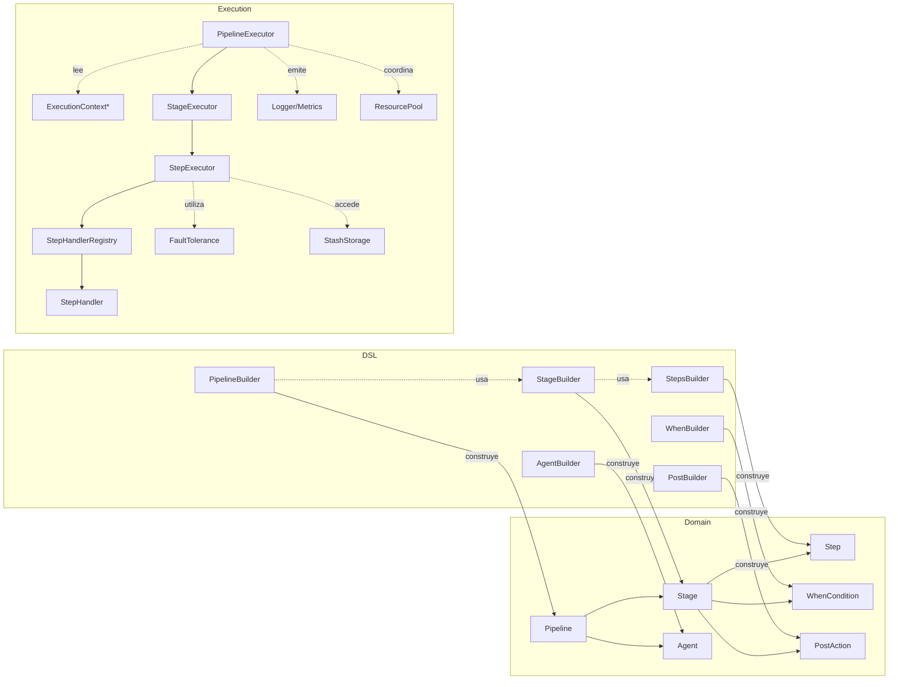
```mermaid
flowchart LR
  subgraph Domain
    A[Pipeline] --> B[Stage]
    B --> C[Step]
    A --> D[Agent]
    B --> E[WhenCondition]
    B --> F[PostAction]
  end

  subgraph DSL
    G[PipelineBuilder] -->|construye| A
    H[StageBuilder] -->|construye| B
    I[StepsBuilder] -->|construye| C
    J[WhenBuilder] -->|construye| E
    K[AgentBuilder] -->|construye| D
    L[PostBuilder] -->|construye| F
  end

  subgraph Execution
    M[ExecutionContext*]
    N[PipelineExecutor]
    O[StageExecutor]
    P[StepExecutor]
    Q[StepHandlerRegistry]
    R[StepHandler]
    S[FaultTolerance]
    T[Logger/Metrics]
    U[ResourcePool]
    V[StashStorage]
  end

  G -. usa .-> H
  H -. usa .-> I
  N --> O --> P
  P --> Q --> R
  P -. utiliza .-> S
  N -. emite .-> T
  P -. accede .-> V
  N -. coordina .-> U
  N -. lee .-> M
```

### Nueva Arquitectura SOLID de Step Handlers

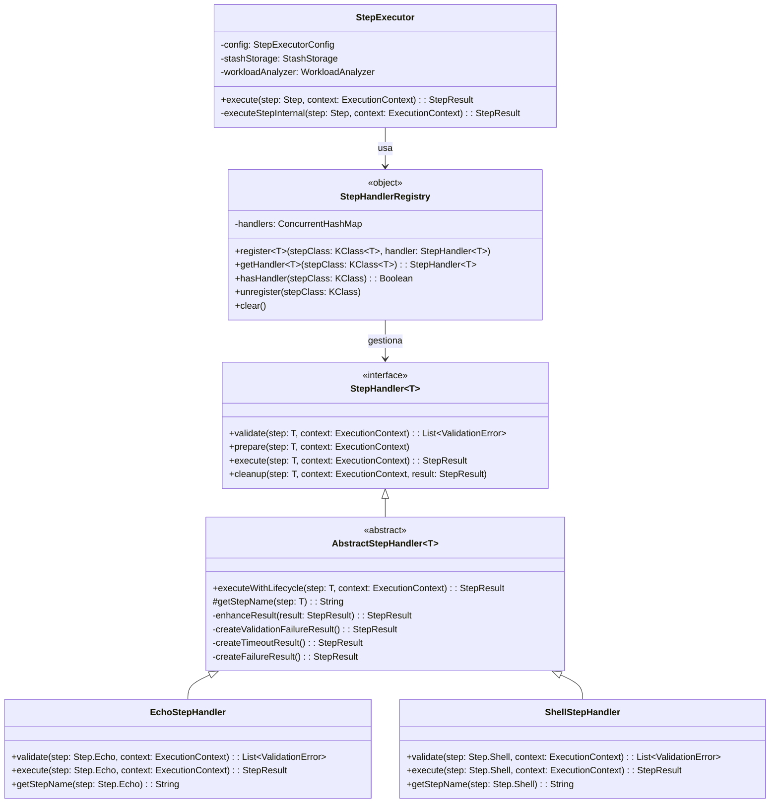
```mermaid
classDiagram
  class StepHandler~T~ {
    <<interface>>
    +validate(step: T, context: ExecutionContext): List~ValidationError~
    +prepare(step: T, context: ExecutionContext)
    +execute(step: T, context: ExecutionContext): StepResult
    +cleanup(step: T, context: ExecutionContext, result: StepResult)
  }
  
  class AbstractStepHandler~T~ {
    <<abstract>>
    +executeWithLifecycle(step: T, context: ExecutionContext): StepResult
    #getStepName(step: T): String
    -enhanceResult(result: StepResult): StepResult
    -createValidationFailureResult(): StepResult
    -createTimeoutResult(): StepResult
    -createFailureResult(): StepResult
  }
  
  class StepHandlerRegistry {
    <<object>>
    -handlers: ConcurrentHashMap
    +register~T~(stepClass: KClass~T~, handler: StepHandler~T~)
    +getHandler~T~(stepClass: KClass~T~): StepHandler~T~
    +hasHandler(stepClass: KClass): Boolean
    +unregister(stepClass: KClass)
    +clear()
  }
  
  class EchoStepHandler {
    +validate(step: Step.Echo, context: ExecutionContext): List~ValidationError~
    +execute(step: Step.Echo, context: ExecutionContext): StepResult
    +getStepName(step: Step.Echo): String
  }
  
  class ShellStepHandler {
    +validate(step: Step.Shell, context: ExecutionContext): List~ValidationError~
    +execute(step: Step.Shell, context: ExecutionContext): StepResult
    +getStepName(step: Step.Shell): String
  }
  
  class StepExecutor {
    -config: StepExecutorConfig
    -stashStorage: StashStorage
    -workloadAnalyzer: WorkloadAnalyzer
    +execute(step: Step, context: ExecutionContext): StepResult
    -executeStepInternal(step: Step, context: ExecutionContext): StepResult
  }
  
  StepHandler <|-- AbstractStepHandler
  AbstractStepHandler <|-- EchoStepHandler
  AbstractStepHandler <|-- ShellStepHandler
  StepExecutor --> StepHandlerRegistry : usa
  StepHandlerRegistry --> StepHandler : gestiona
```

**Beneficios Clave:**
- **Responsabilidad Única**: Cada handler se enfoca en un tipo de step
- **Abierto/Cerrado**: Se pueden añadir nuevos tipos de step sin modificar el código existente
- **Sustitución de Liskov**: Todos los handlers implementan la misma interfaz
- **Segregación de Interfaces**: Interfaces limpias y enfocadas
- **Inversión de Dependencias**: StepExecutor depende de abstracciones


## Modelo de dominio

Las clases principales están en `dev.rubentxu.hodei.core.domain.model`:

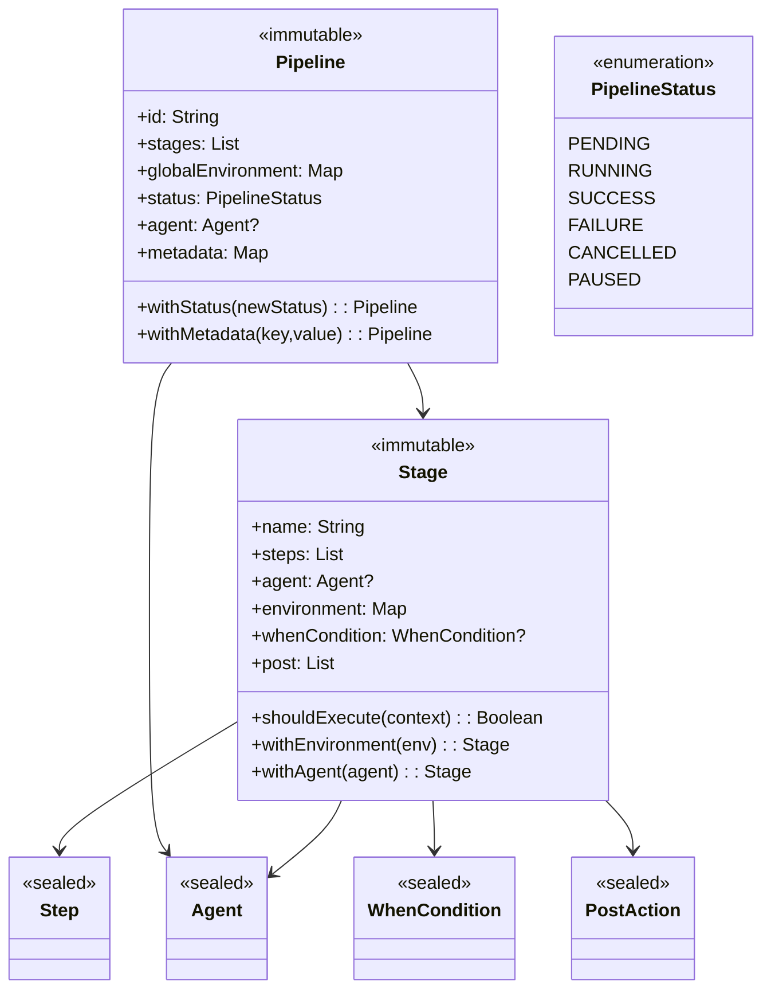
```mermaid
classDiagram
  class Pipeline {
    +id: String
    +stages: List<Stage>
    +globalEnvironment: Map<String,String>
    +status: PipelineStatus
    +agent: Agent?
    +metadata: Map<String,Any>
    +withStatus(newStatus): Pipeline
    +withMetadata(key,value): Pipeline
    <<immutable>>
  }
  class Stage {
    +name: String
    +steps: List<Step>
    +agent: Agent?
    +environment: Map<String,String>
    +whenCondition: WhenCondition?
    +post: List<PostAction>
    +shouldExecute(context): Boolean
    +withEnvironment(env): Stage
    +withAgent(agent): Stage
    <<immutable>>
  }
  class Step {
    <<sealed>>
  }
  class Agent { <<sealed>> }
  class PostAction { <<sealed>> }
  class WhenCondition { <<sealed>> }
  class PipelineStatus {
    <<enumeration>>
    PENDING
    RUNNING
    SUCCESS
    FAILURE
    CANCELLED
    PAUSED
  }
  
  Pipeline --> Stage
  Stage --> Step
  Pipeline --> Agent
  Stage --> Agent
  Stage --> WhenCondition
  Stage --> PostAction
```

**Tipos de Step soportados** (ver `Step.kt`): `Shell`, `Echo`, `Dir`, `WithEnv`, `Parallel`, `Retry`, `Timeout`, `ArchiveArtifacts`, `PublishTestResults`, `Stash`, `Unstash`.

**Agentes soportados**: `Any`, `None`, `Label`, `Docker(image, args, volumes, environment)`, `Kubernetes(yaml, namespace)`.

**WhenConditions**: `Branch`, `Environment`, `Predicate` (funcional), `ChangeSet`, combinadores `And/Or/Not`.

## Sistema de Handlers de Steps

El nuevo sistema de handlers implementa el patrón Strategy para la ejecución de steps, siguiendo principios SOLID.

### Flujo del Ciclo de Vida del Handler

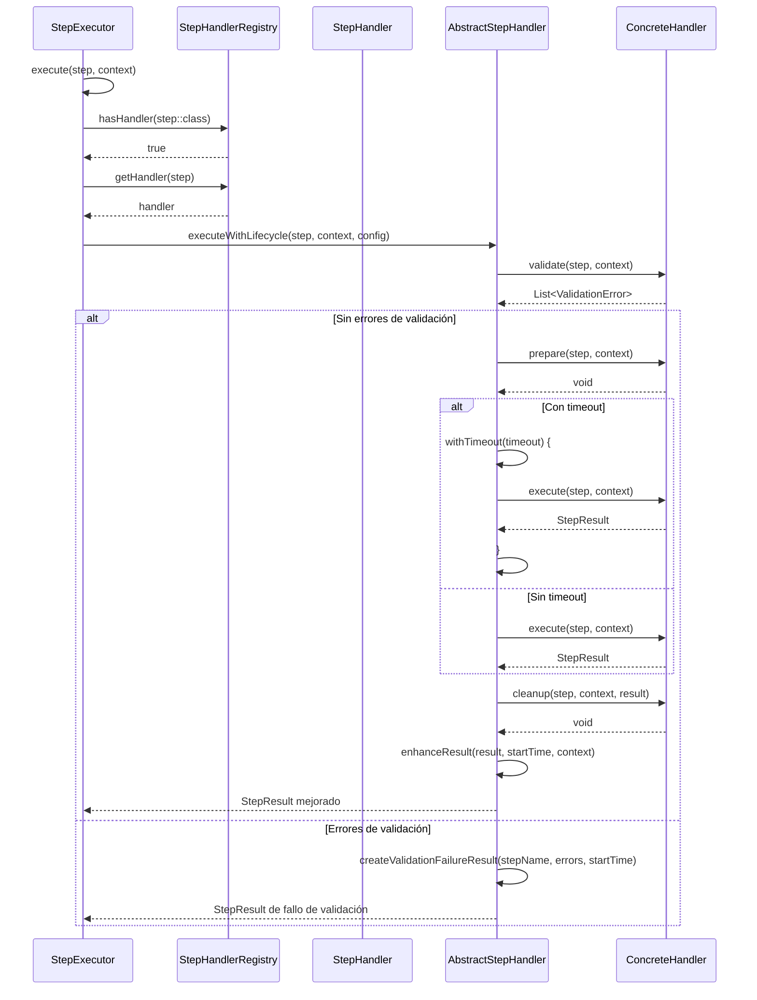
```mermaid
sequenceDiagram
  participant SE as StepExecutor
  participant SR as StepHandlerRegistry
  participant SH as StepHandler
  participant AH as AbstractStepHandler
  participant CH as ConcreteHandler

  SE->>SE: execute(step, context)
  SE->>SR: hasHandler(step::class)
  SR-->>SE: true
  SE->>SR: getHandler(step)
  SR-->>SE: handler
  SE->>AH: executeWithLifecycle(step, context, config)
  
  AH->>CH: validate(step, context)
  CH-->>AH: List<ValidationError>
  
  alt Sin errores de validación
    AH->>CH: prepare(step, context)
    CH-->>AH: void
    
    alt Con timeout
      AH->>AH: withTimeout(timeout) {
      AH->>CH: execute(step, context)
      CH-->>AH: StepResult
      AH->>AH: }
    else Sin timeout
      AH->>CH: execute(step, context)
      CH-->>AH: StepResult
    end
    
    AH->>CH: cleanup(step, context, result)
    CH-->>AH: void
    AH->>AH: enhanceResult(result, startTime, context)
    AH-->>SE: StepResult mejorado
  else Errores de validación
    AH->>AH: createValidationFailureResult(stepName, errors, startTime)
    AH-->>SE: StepResult de fallo de validación
  end
```

### Handlers Implementados Actualmente

#### FASE 1: Infraestructura ✅
- Interfaz `StepHandler<T>`
- Objeto `StepHandlerRegistry`
- Clase base `AbstractStepHandler`
- Integración con `StepExecutor`

#### FASE 2: Handlers Simples ✅
- `EchoStepHandler` - maneja `Step.Echo`
- `ShellStepHandler` - maneja `Step.Shell`
- `ArchiveArtifactsStepHandler` - maneja `Step.ArchiveArtifacts`
- `PublishTestResultsStepHandler` - maneja `Step.PublishTestResults`
- `StashStepHandler` - maneja `Step.Stash`
- `UnstashStepHandler` - maneja `Step.Unstash`

#### FASE 3: Handlers Complejos (Pendiente)
- `DirStepHandler` - para `Step.Dir`
- `WithEnvStepHandler` - para `Step.WithEnv`
- `ParallelStepHandler` - para `Step.Parallel`
- `RetryStepHandler` - para `Step.Retry`
- `TimeoutStepHandler` - para `Step.Timeout`

### Registro de Handlers

```mermaid
flowchart LR
  A[DefaultHandlerRegistration] --> B[registerDefaultHandlers()]
  B --> C[StepHandlerRegistry.register]
  C --> D[EchoStepHandler]
  C --> E[ShellStepHandler]
  C --> F[ArchiveArtifactsStepHandler]
  C --> G[PublishTestResultsStepHandler]
  C --> H[StashStepHandler]
  C --> I[UnstashStepHandler]
```

## Flujo de Ejecución

### Flujo Completo de Ejecución del Pipeline

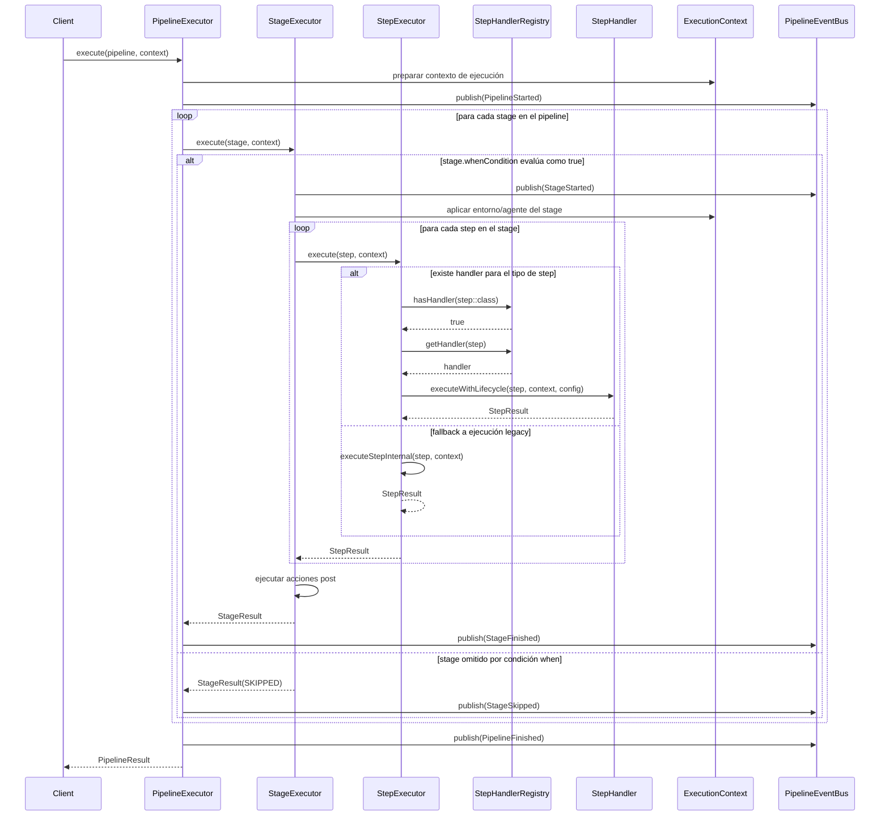
```mermaid
sequenceDiagram
  participant Client
  participant PE as PipelineExecutor
  participant SE as StageExecutor
  participant STE as StepExecutor
  participant SHR as StepHandlerRegistry
  participant SH as StepHandler
  participant CTX as ExecutionContext
  participant BUS as PipelineEventBus

  Client->>PE: execute(pipeline, context)
  PE->>CTX: preparar contexto de ejecución
  PE->>BUS: publish(PipelineStarted)
  
  loop para cada stage en el pipeline
    PE->>SE: execute(stage, context)
    
    alt stage.whenCondition evalúa como true
      SE->>BUS: publish(StageStarted)
      SE->>CTX: aplicar entorno/agente del stage
      
      loop para cada step en el stage
        SE->>STE: execute(step, context)
        
        alt existe handler para el tipo de step
          STE->>SHR: hasHandler(step::class)
          SHR-->>STE: true
          STE->>SHR: getHandler(step)
          SHR-->>STE: handler
          STE->>SH: executeWithLifecycle(step, context, config)
          SH-->>STE: StepResult
        else fallback a ejecución legacy
          STE->>STE: executeStepInternal(step, context)
          STE-->>STE: StepResult
        end
        
        STE-->>SE: StepResult
      end
      
      SE->>SE: ejecutar acciones post
      SE-->>PE: StageResult
      PE->>BUS: publish(StageFinished)
    else stage omitido por condición when
      SE-->>PE: StageResult(SKIPPED)
      PE->>BUS: publish(StageSkipped)
    end
  end
  
  PE->>BUS: publish(PipelineFinished)
  PE-->>Client: PipelineResult
```

### Flujo de Decisión de Ejecución de Steps

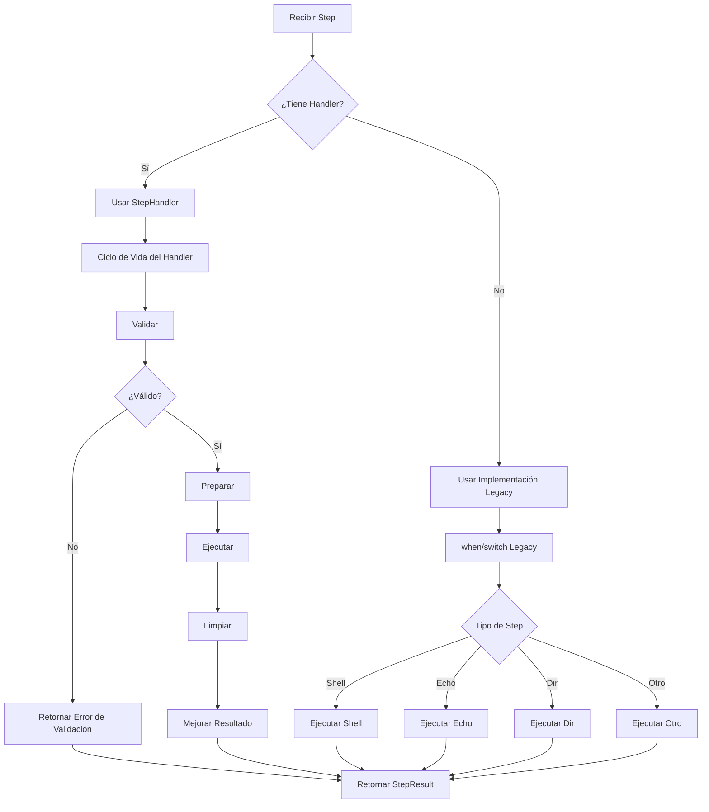
```mermaid
flowchart TD
  A[Recibir Step] --> B{¿Tiene Handler?}
  B -->|Sí| C[Usar StepHandler]
  B -->|No| D[Usar Implementación Legacy]
  
  C --> E[Ciclo de Vida del Handler]
  E --> F[Validar]
  F --> G{¿Válido?}
  G -->|No| H[Retornar Error de Validación]
  G -->|Sí| I[Preparar]
  I --> J[Ejecutar]
  J --> K[Limpiar]
  K --> L[Mejorar Resultado]
  L --> M[Retornar StepResult]
  
  D --> N[when/switch Legacy]
  N --> O{Tipo de Step}
  O -->|Shell| P[Ejecutar Shell]
  O -->|Echo| Q[Ejecutar Echo]
  O -->|Dir| R[Ejecutar Dir]
  O -->|Otro| S[Ejecutar Otro]
  P --> M
  Q --> M
  R --> M
  S --> M
  
  H --> M
```


## DSL (Builders tipados)

Paquete: `dev.rubentxu.hodei.core.dsl.builders`.

- `PipelineBuilder`: define `agent`, `environment`, `stage`, `post` y construye `Pipeline`.
- `StageBuilder`: define agente por stage, variables, `when`, `steps`, `post`. Incluye atajo `sh("cmd")` para stages simples.
- `StepsBuilder`: provee operaciones de steps: `sh`, `echo`, `dir {}`, `withEnv(List<String>) {}`, `parallel {}`, `retry {}`, `timeout {}`, `archiveArtifacts`, `publishTestResults`, `stash`, `unstash`, `emailext` (helper).
- `WhenBuilder`, `AgentBuilder`, `EnvironmentBuilder`, `PostBuilder`: sub-builders especializados.

### Ejemplo Básico

```kotlin
val pipeline = pipeline {
  agent { any() }
  environment {
    set("JAVA_HOME", "/opt/jdk")
  }
  stage("Build") {
    steps {
      sh("./gradlew build")
      archiveArtifacts("build/libs/*.jar", fingerprint = true)
    }
  }
  stage("Test") {
    steps {
      sh("./gradlew test")
      publishTestResults("build/test-results/test/*.xml")
    }
  }
}
```

### Flujo de Construcción de la DSL

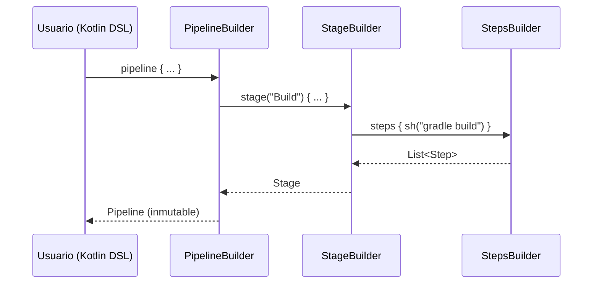
```mermaid
sequenceDiagram
  participant U as Usuario (Kotlin DSL)
  participant PB as PipelineBuilder
  participant SB as StageBuilder
  participant StB as StepsBuilder
  U->>PB: pipeline { ... }
  PB->>SB: stage("Build") { ... }
  SB->>StB: steps { sh("gradle build") }
  StB-->>SB: List<Step>
  SB-->>PB: Stage
  PB-->>U: Pipeline (inmutable)
```


## Mecanismos de extensión de Steps

### Extensión por Plugins

Dos partes claramente definidas:
- Mecanismo de Registro (terceros): implementa StepExtension con un scope tipado y se registra vía ServiceLoader (META-INF/services) o programáticamente para tests.
- Generación de DSL tipado (core): funciones de extensión sobre StepsBuilder que crean el scope y delegan en StepExtensionRegistry.

Contrato (core):
```kotlin
interface StepExtension {
  val name: String
  fun createScope(): Any
  fun execute(scope: Any, stepsBuilder: StepsBuilder)
}

object StepExtensionRegistry {
  fun get(name: String): StepExtension?
  fun register(extension: StepExtension)
  fun unregister(name: String)
}

// Soporte en StepsBuilder para uso por código generado
fun StepsBuilder.invokeExtension(name: String, scope: Any)
```
Ejemplo de función generada (por el sistema, o escrita a mano):
```kotlin
// En plugin-slack (generado):
class SlackStepScope { var message: String = ""; var channel: String = "#general" }

fun StepsBuilder.slack(block: SlackStepScope.() -> Unit) {
  val scope = SlackStepScope().apply(block)
  invokeExtension("slack", scope)
}
```
Si el plugin no está disponible, se lanza PipelineExecutionException con un mensaje claro.

En el módulo core existen dos formas de extender la capacidad de "steps", según el nivel de integración que necesites:

1) Azúcar DSL mediante funciones de extensión (sin crear nuevos tipos de Step)
- Útil para encapsular comandos o combinaciones de steps existentes (p. ej., invocar herramientas externas con sh, envolver con retry/timeout, etc.).
- No requiere tocar el dominio ni el ejecutor; simplemente añade funciones sobre StepsBuilder que añaden Steps ya soportados.
- Ventaja: cero cambios en el motor; ideal para equipos que quieren nomenclatura propia.
- Limitación: no introduce un nuevo tipo en Step; se apoya en los existentes (Shell, Parallel, Retry, ...).

Ejemplo (dentro de tu código o en el módulo :steps):
```kotlin
// Ejecuta Gradle con flags estándar de tu equipo
fun StepsBuilder.gradle(task: String, flags: List<String> = emptyList()) {
  val args = (listOf("./gradlew", task) + flags).joinToString(" ")
  sh(args)
}

// Publica JUnit + archiva reportes como una operación compuesta
fun StepsBuilder.publishQaReports() {
  publishTestResults("build/test-results/test/*.xml", allowEmptyResults = false)
  archiveArtifacts("build/reports/**", fingerprint = true)
}
```
Uso:
```kotlin
steps {
  gradle("build", flags = listOf("-x test"))
  retry(times = 2) { gradle("test") }
  publishQaReports()
}
```

2) Nuevos tipos de Step (integración profunda)
- Requiere añadir una nueva variante a la jerarquía sellada Step del core y su ejecución en StepExecutor.
- Pasos:
  - Dominio: añadir data class en Step.kt (p. ej., data class MyStep(...): Step()).
  - DSL: añadir función en StepsBuilder para crear tu Step (p. ej., fun myStep(...)).
  - Ejecutor: añadir el caso correspondiente en StepExecutor.executeStepInternal y sus helpers.
- Ventaja: aparece como step de primera clase con métricas y tratamiento específico.
- Limitación: al ser una sealed class, la ampliación sólo es posible modificando el core (mismo archivo de la sealed) y manteniendo coherencia en el ejecutor.

Diagrama del flujo de ampliación (profunda):
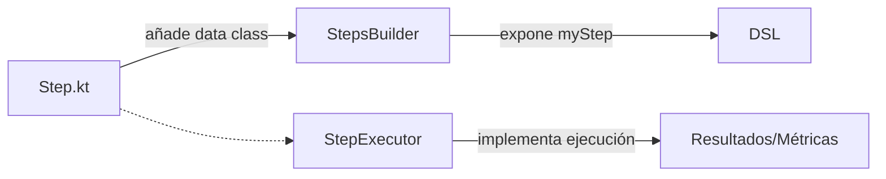
```mermaid
flowchart LR
  A[Step.kt] -->|añade data class| B[StepsBuilder]
  B -->|expone myStep| C[DSL]
  A -.-> D[StepExecutor]
  D -->|implementa ejecución| E[Resultados/Métricas]
```

3) Plugins (extensión fuera de core)
- Para extensiones desacopladas, el sistema de plugins documentado en docs/plugin-system.md permite:
  - Registrar nuevos proveedores de steps y generar azúcar DSL automaticamente.
  - Carga dinámica (hot-load), aislamiento por ClassLoader y generación type-safe (vía :compiler).
- Cómo se integra con los steps:
  - Los plugins pueden exponer funciones sobre StepsBuilder que o bien compongan steps existentes (vía sh/withEnv/parallel/...), o deleguen en ejecutores/adaptadores provistos por el plugin.
  - Dado que Step es sealed en core, los plugins típicamente no crean subclases de Step directamente; en su lugar, generan DSL que compone pasos existentes o invocan lanzadores/servicios externos.
- Referencia: ver docs/plugin-system.md para API (StepPlugin, DSLExtensionPlugin) y ejemplos (Docker, Slack).

Patrón recomendado
- Si basta con encapsular comandos y combinaciones: usa funciones de extensión sobre StepsBuilder (mantenible y sin tocar core).
- Si necesitas un comportamiento de primer nivel con tratamiento especial: añade un nuevo Step en core + soporte en StepExecutor (requiere cambio del módulo core).
- Si deseas publicar y distribuir funcionalidades sin tocar core: crea un plugin y genera azúcar DSL que componga steps existentes o use adaptadores.

## Ejecución del pipeline

El motor de ejecución en `dev.rubentxu.hodei.core.execution` orquesta la ejecución concurrente y tolerante a fallos.

Componentes principales:
- `ExecutionContext`, `ExecutionContextFactory`, `ExecutionContextBuilder`: encapsulan entorno, variables, workspace y utilidades para la ejecución.
- `PipelineExecutor`: coordina stages, aplica timeouts globales y publica eventos.
- `StageExecutor`: evalúa `whenCondition`, aplica `agent/environment` y ejecuta steps del stage.
- `StepExecutor`: ejecuta cada `Step` con validaciones, selección de dispatcher (CPU/IO), timeouts, reintentos, paralelismo, stash/unstash, junit/artifacts, etc.
- `FaultTolerance` y `FaultToleranceConfig`: backoff, reintentos y degradación suave.
- `PipelineLogger` y `ConfigurablePipelineLogger`: logging estructurado por niveles.
- `PipelineMetrics`: latencias, contadores y estados por etapa/step.
- `ResourcePool`: control de concurrencia y permisos.
- `StashStorage` (p. ej., `FileSystemStashStorage`): persistencia temporal de artefactos entre stages.

Diagrama de secuencia de ejecución:

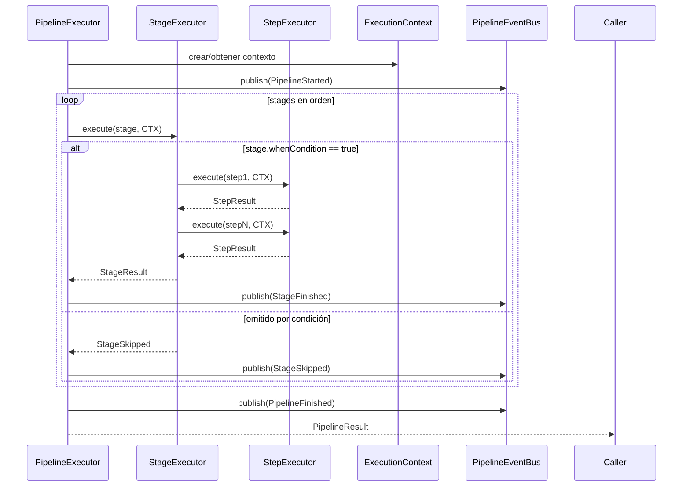
```mermaid
sequenceDiagram
  participant PE as PipelineExecutor
  participant SE as StageExecutor
  participant STE as StepExecutor
  participant CTX as ExecutionContext
  participant BUS as PipelineEventBus

  PE->>CTX: crear/obtener contexto
  PE->>BUS: publish(PipelineStarted)
  loop stages en orden
    PE->>SE: execute(stage, CTX)
    alt stage.whenCondition == true
      SE->>STE: execute(step1, CTX)
      STE-->>SE: StepResult
      SE->>STE: execute(stepN, CTX)
      STE-->>SE: StepResult
      SE-->>PE: StageResult
      PE->>BUS: publish(StageFinished)
    else omitido por condición
      SE-->>PE: StageSkipped
      PE->>BUS: publish(StageSkipped)
    end
  end
  PE->>BUS: publish(PipelineFinished)
  PE-->>Caller: PipelineResult
```

Control de tiempo y concurrencia:
- `timeout` por step (`Step.Timeout`) y timeouts globales de stages/pipeline mediante config.
- `parallel` ejecuta ramas en paralelo con coroutines y `Semaphore` donde aplica.
- `retry` reintenta bloques de steps según política configurada (`FaultTolerance`).


## Tolerancia a fallos y degradación

- Reintentos exponenciales para `Retry` y para fallos transitorios en `StepExecutor`.
- Degradación suave (`GracefulDegradation`): permitir continuar cuando los errores son no críticos (configurable).
- Resultados tipados: `StepResult`, `StageResult`, `PipelineResult` con tiempos (`Instant`), `Duration`, errores, estados.

Flujo de decisión de un step (simplificado):

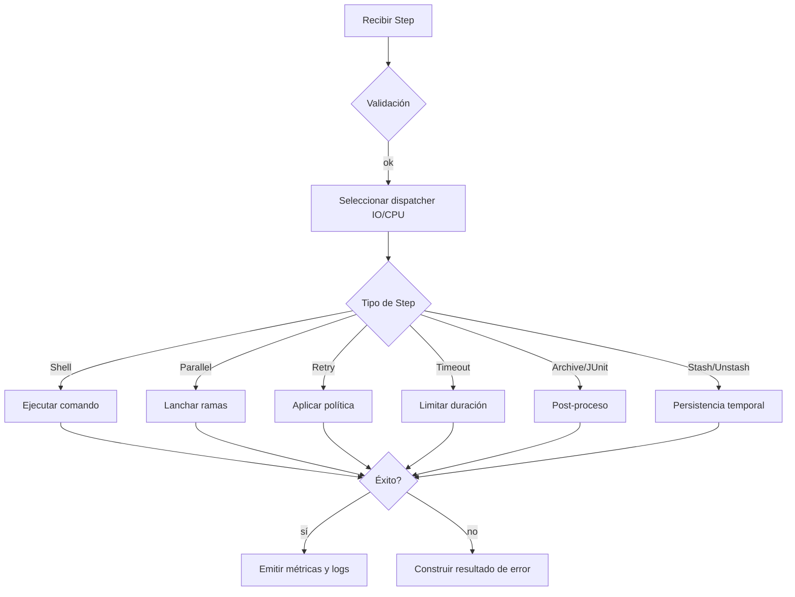
```mermaid
flowchart TD
  A[Recibir Step] --> B{Validación}
  B -- ok --> C[Seleccionar dispatcher IO/CPU]
  C --> D{Tipo de Step}
  D -->|Shell| E[Ejecutar comando]
  D -->|Parallel| F[Lanchar ramas]
  D -->|Retry| G[Aplicar política]
  D -->|Timeout| H[Limitar duración]
  D -->|Archive/JUnit| I[Post-proceso]
  D -->|Stash/Unstash| J[Persistencia temporal]
  E --> K{Éxito?}
  F --> K
  G --> K
  H --> K
  I --> K
  J --> K
  K -- sí --> L[Emitir métricas y logs]
  K -- no --> M[Construir resultado de error]
```


## Ejemplos

- Ejemplo básico: `examples/simple-pipeline.kts`
- Paralelismo avanzado: `examples/advanced-parallel.pipeline.kts`
- Integración con build real: `examples/test-integration.pipeline.kts`

Fragmento con paralelismo y reintento:

```kotlin
stage("Verify") {
  steps {
    parallel {
      branch("unit") { sh("./gradlew test") }
      branch("lint") { sh("./gradlew ktlintCheck") }
    }
    retry(times = 3) {
      sh("./gradlew flakyIntegrationTest")
    }
  }
}
```


## Integración con otros módulos

- `:execution`: contiene implementaciones y pruebas adicionales de ejecución; comparte conceptos con core pero enfocado a escenarios de runtime.
- `:compiler`: integración con scripting y Tooling API para compilar pipelines `.kts` y resolver dependencias.
- `:steps` y `:plugins`: extensión del ecosistema de steps y plugins.
- `:cli` y `:library`: empaquetado y acceso programático/CLI.

### Dependencias del Módulo

El módulo core mantiene dependencias mínimas para preservar la pureza del dominio:
- Kotlin stdlib y coroutines
- kotlinx-serialization para soporte JSON (donde aplique)

### Interacción Cross-Módulo

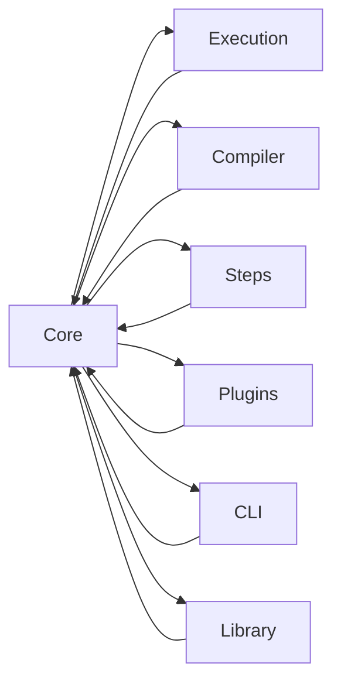
```mermaid
flowchart LR
  A[Core] --> B[Execution]
  A --> C[Compiler]
  A --> D[Steps]
  A --> E[Plugins]
  A --> F[CLI]
  A --> G[Library]
  
  B --> A
  C --> A
  D --> A
  E --> A
  F --> A
  G --> A
```


## Pruebas

### Framework y Estructura

- **Framework**: Kotest 5 + JUnit Platform, con tests en `core/src/test/kotlin`.
- **Categorías de Tests**:
  - Tests de dominio: `PipelineModelSpec`, `WhenConditionSpec`
  - Tests de DSL: `DSLBuilderSpec`
  - Tests de ejecución: `ExecutionContextSpec`, `StashSystemSpec`
  - Tests de handlers: `EchoStepHandlerSpec`, `HandlerRegistrationSpec`
  - Tests de integración: `PipelineDSLGradleBuildSpec`

### Estrategia de Testing para Handlers

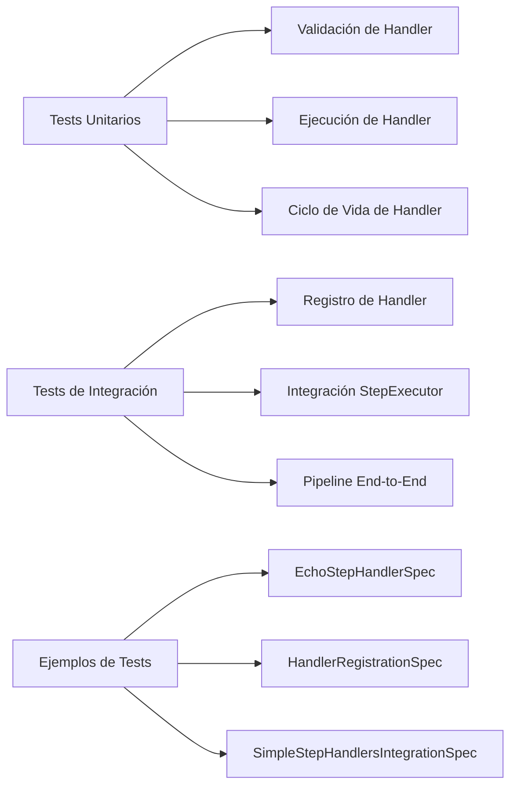
```mermaid
flowchart LR
  A[Tests Unitarios] --> B[Validación de Handler]
  A --> C[Ejecución de Handler]
  A --> D[Ciclo de Vida de Handler]
  
  E[Tests de Integración] --> F[Registro de Handler]
  E --> G[Integración StepExecutor]
  E --> H[Pipeline End-to-End]
  
  I[Ejemplos de Tests] --> J[EchoStepHandlerSpec]
  I --> K[HandlerRegistrationSpec]
  I --> L[SimpleStepHandlersIntegrationSpec]
```

### Ejecutar Tests

```bash
# Módulo core únicamente
gradle :core:test

# Test específico
gradle :core:test --tests "dev.rubentxu.hodei.core.execution.handlers.EchoStepHandlerSpec"

# Solo tests de handlers
gradle :core:test --tests "*Handler*"
```


## Referencias

- Documentación del repo en `docs/`:
  - `docs/architecture.md` – visión de arquitectura global
  - `docs/execution-model.md` – detalle del modelo de ejecución
  - `docs/dsl-specification.md` – especificación de la DSL
  - `docs/plugin-system.md` – sistema de plugins
  - `docs/examples/*` – ejemplos prácticos


## Dependencias del módulo

El módulo core mantiene dependencias mínimas para preservar la pureza del dominio:
- Kotlin stdlib y coroutines
- kotlinx-serialization para soporte JSON (donde aplica)


## Estados y transiciones

A nivel de dominio y ejecución se gestionan estados de Pipeline, Stage y Step con transiciones explícitas.

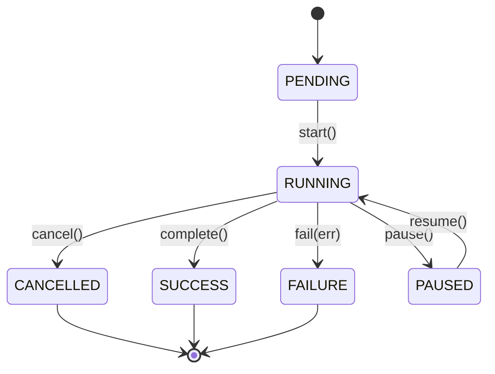
```mermaid
stateDiagram-v2
  [*] --> PENDING
  PENDING --> RUNNING: start()
  RUNNING --> SUCCESS: complete()
  RUNNING --> FAILURE: fail(err)
  RUNNING --> CANCELLED: cancel()
  RUNNING --> PAUSED: pause()
  PAUSED --> RUNNING: resume()
  CANCELLED --> [*]
  SUCCESS --> [*]
  FAILURE --> [*]
```

Notas:
- Un Stage omitido por whenCondition no cambia a FAILURE/SUCCESS sino a SKIPPED (estado lógico interno). El Pipeline puede ser SUCCESS aunque existan SKIPPED.
- Los PostActions se ejecutan tras SUCCESS/FAILURE si así se configuró.


## Evaluación de WhenCondition

`WhenCondition` permite filtrar la ejecución de un Stage en función del contexto (rama, variables, cambios, predicados).

Tipos soportados (ver WhenCondition.kt y WhenConditionDSL.kt):
- Branch(nameOrPattern)
- Environment(name, value)
- ChangeSet(paths: List<String>, mode = Any|All)
- Predicate((ExecutionContext) -> Boolean)
- Combinadores: And(list), Or(list), Not(inner)

Nota sobre la DSL actual: el builder usa nombres `allOf {}`, `anyOf {}` y `not { }` (en lugar de `and`/`or`), y expone `expression(String)` por compatibilidad. La función del builder se llama ``when` { ... }`` (backticks por ser palabra reservada). En el modelo de dominio, `Expression` está marcada como deprecated en favor de `predicate { ctx -> ... }` cuando se usa programáticamente. La DSL aún no expone directamente `changeSet(...)` ni `predicate {}`; pueden modelarse vía `expression(...)` o mediante integración de contexto.

Orden de evaluación y cortocircuito:

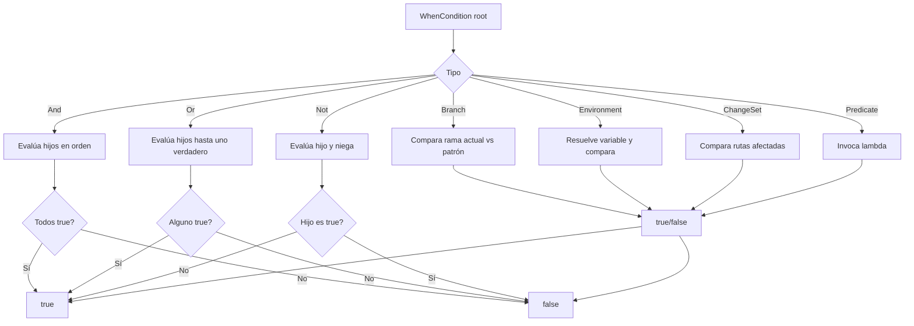
```mermaid
flowchart TD
  A[WhenCondition root] --> B{Tipo}
  B -->|And| C[Evalúa hijos en orden]
  B -->|Or| D[Evalúa hijos hasta uno verdadero]
  B -->|Not| E[Evalúa hijo y niega]
  B -->|Branch| F[Compara rama actual vs patrón]
  B -->|Environment| G[Resuelve variable y compara]
  B -->|ChangeSet| H[Compara rutas afectadas]
  B -->|Predicate| I[Invoca lambda]
  C --> J{Todos true?}
  D --> K{Alguno true?}
  E --> L{Hijo es true?}
  J -->|Sí| M[true]
  J -->|No| N[false]
  K -->|Sí| M
  K -->|No| N
  L -->|Sí| N
  L -->|No| M
  F --> O[true/false]
  G --> O
  H --> O
  I --> O
  O --> M
  O --> N
```

Ejemplo DSL:
```kotlin
stage("Deploy") {
  `when` {
    allOf {
      branch("main")
      environment("CI", "true")
      not { environment("DRY_RUN", "true") }
    }
  }
  steps { echo("Deploying...") }
}
```


## Resolución de Environment y precedencias

Entendiendo de dónde vienen las variables y cómo se combinan.

Fuentes de variables:
- Sistema (System.getenv / System.getProperty) – opcional según configuración
- Environment global del Pipeline
- Environment específico del Stage
- Bloques `withEnv` en Steps
- Inyección dinámica desde `ExecutionContext` (p. ej., variables de evento, workspace, jobId)

Reglas de precedencia (de menor a mayor):
1) Sistema
2) Pipeline.globalEnvironment
3) Stage.environment
4) withEnv del Step (más interno gana)
5) Variables temporales del propio Step (p. ej., salidas capturadas)

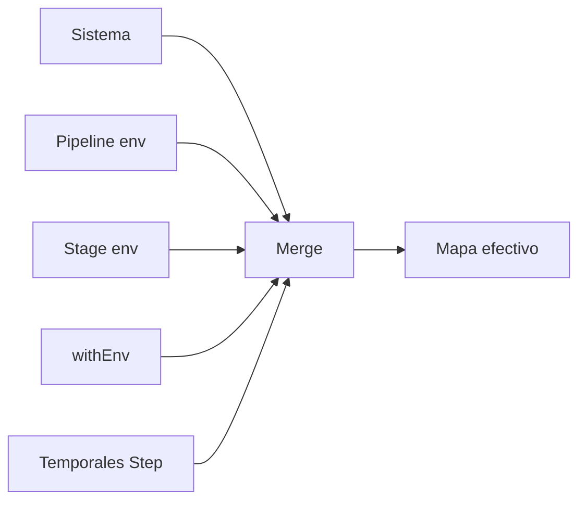
```mermaid
flowchart LR
  SYS[Sistema] --> M[Merge]
  P[Pipeline env] --> M
  S[Stage env] --> M
  W[withEnv] --> M
  T[Temporales Step] --> M
  M --> R[Mapa efectivo]
```


## Resolución de Agent

Un `Agent` puede definirse a nivel de Pipeline y sobreescribirse en cada Stage. Tipos comunes: Any, None, Label, Docker, Kubernetes.

- Si Stage define Agent, tiene prioridad.
- Si no, se usa el Agent del Pipeline.
- `None` implica ejecución local actual sin agente dedicado.

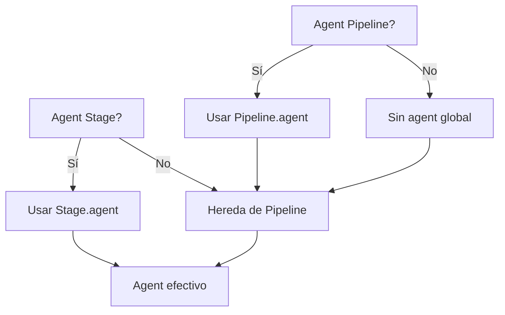
```mermaid
flowchart TD
  A[Agent Pipeline?] -->|Sí| B[Usar Pipeline.agent]
  A -->|No| C[Sin agent global]
  D[Agent Stage?] -->|Sí| E[Usar Stage.agent]
  D -->|No| F[Hereda de Pipeline]
  E --> G[Agent efectivo]
  F --> G
  B --> F
  C --> F
```


## Contexto de ejecución (ExecutionContext)

`ExecutionContext` encapsula:
- workspace: directorio de trabajo
- env: mapa efectivo de variables
- jobInfo: id, intento, etiquetas
- launchers: `CommandLauncher` para shells, IO services
- logger, metrics, eventBus
- config: `ExecutorConfig`, `FaultToleranceConfig`

Ciclo de vida:

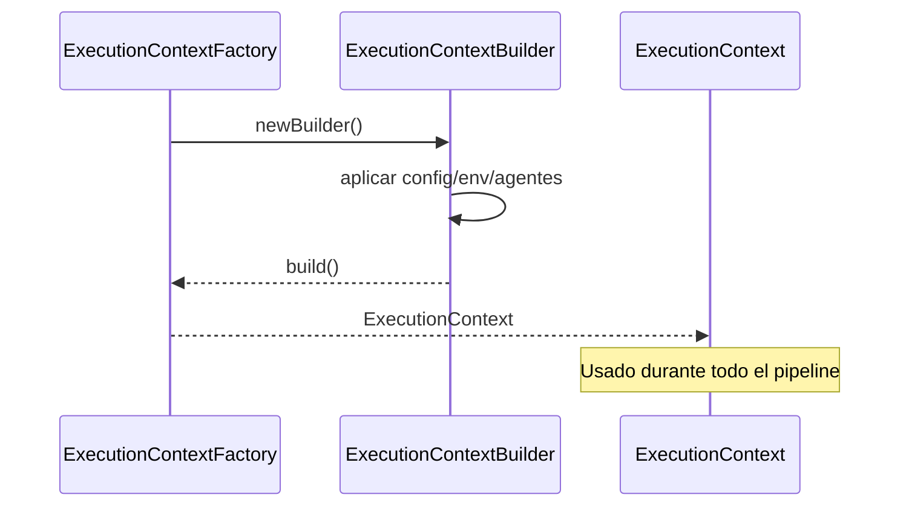
```mermaid
sequenceDiagram
  participant F as ExecutionContextFactory
  participant B as ExecutionContextBuilder
  participant E as ExecutionContext
  F->>B: newBuilder()
  B->>B: aplicar config/env/agentes
  B-->>F: build()
  F-->>E: ExecutionContext
  note over E: Usado durante todo el pipeline
```


## Métricas y eventos

- `PipelineMetrics`: latencias por step/stage, contadores de éxito/fallo, histogramas de duración.
- `PipelineEvents`: Started/Finished para Pipeline/Stage/Step, StepRetried, ArtifactArchived, TestResultsPublished, Stashed/Unstashed, etc.

Ejemplo de flujo de eventos:

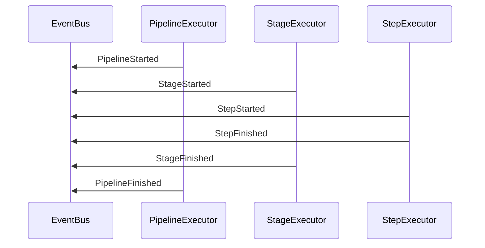
```mermaid
sequenceDiagram
  participant BUS as EventBus
  participant PE as PipelineExecutor
  participant SE as StageExecutor
  participant STE as StepExecutor
  PE->>BUS: PipelineStarted
  SE->>BUS: StageStarted
  STE->>BUS: StepStarted
  STE->>BUS: StepFinished
  SE->>BUS: StageFinished
  PE->>BUS: PipelineFinished
```

Estructura de una métrica típica:
- name: hodei.step.duration
- tags: pipelineId, stage, stepType, status
- value: Duration en ms


## ResourcePool y control de concurrencia

`ResourcePool` permite limitar concurrencia global y por recurso:
- Semáforos por etiqueta (p. ej., docker, network, cpuBound)
- Políticas de cola (FIFO) y timeouts

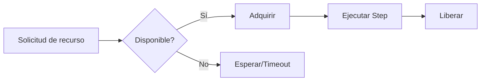
```mermaid
flowchart LR
  A[Solicitud de recurso] --> B{Disponible?}
  B -->|Sí| C[Adquirir]
  B -->|No| D[Esperar/Timeout]
  C --> E[Ejecutar Step]
  E --> F[Liberar]
```

Uso implícito: el `StepExecutor` determina el tipo de carga (IO/CPU) y decide qué semáforo usar.


## Stash/Unstash ciclo de vida

`StashStorage` guarda artefactos intermedios por nombre para moverlos entre stages.

```mermaid
sequenceDiagram
  participant STE as StepExecutor
  participant ST as StashStorage
  STE->>ST: stash(name, includes, excludes)
  ST-->>STE: StashId
  Note over STE,ST: Tiempo transcurre entre stages
  STE->>ST: unstash(name)
  ST-->>STE: archivos en workspace
```

Consideraciones:
- Por defecto puede usar filesystem local en `.hodei/stash` dentro del workspace
- Políticas de expiración configurables
- Tamaño y filtros por glob


## Validaciones en el dominio

- Pipeline: id no vacío; nombres de stages únicos; no stages vacíos; env sin claves vacías.
- Stage: name no vacío; steps no vacíos; combinación válida de agent y environment.
- Steps: parámetros obligatorios; rutas válidas; patrones glob correctos; tiempos positivos en timeout.
- WhenCondition: listas no vacías para And/Or; patrones de branch válidos.

Errores se representán mediante `ValidationError` y excepciones específicas en ejecución (`ExecutionException`, `TimeoutException`, etc.).


## Modelo de concurrencia y dispatchers

- CPU-bound: usa dispatcher dedicado (p. ej., Default) y controla paralelismo.
- IO-bound: usa dispatcher IO.
- `parallel { }`: cada rama se ejecuta en una coroutine hija con supervisión.
- Cancelación cooperativa: cancel de pipeline/etapa cancela coroutines hijas.

```mermaid
flowchart TB
  P[Pipeline scope] --> S1[Stage 1]
  P --> S2[Stage 2]
  S1 --> R1[parallel: rama A]
  S1 --> R2[parallel: rama B]
  R1 --> ST1[steps A]
  R2 --> ST2[steps B]
```


## Post Actions

PostActions comunes: `Always`, `Success`, `Failure`, `Changed`, `Cleanup` con operaciones como `archiveArtifacts`, `publishTestResults`, `emailext`, `sh`.

Ejecución:
- Tras finalizar el Stage, se evalúan las secciones post en orden y sólo ejecutan si su condición aplica.

```mermaid
flowchart TD
  A[Stage finished] --> B{Status}
  B -->|SUCCESS| C[Post: Success + Always + Changed?]
  B -->|FAILURE| D[Post: Failure + Always + Changed?]
  B -->|CANCELLED| E[Post: Always]
  C --> F[Ejecutar acciones]
  D --> F
  E --> F
```


## Seguridad y saneamiento

- Variables de entorno: evitar exponer secretos en logs (logger aplica redacción si se configura).
- Comandos shell: lanzar mediante `CommandLauncher` con cuidado de escapes; preferir parámetros en lugar de concatenaciones.
- Limitar entradas externas en `unstash` y `archiveArtifacts` con globs controlados.


## Buenas prácticas

- Mantener el dominio como inmutable y pequeño; usar helpers `withX` para modificaciones seguras.
- Preferir funciones de extensión sobre StepsBuilder para crear azúcares DSL sin tocar el core.
- Usar `retry` selectivamente y con backoff razonable; combinar con `timeout`.
- Nombrar stages y ramas de `parallel` de manera clara para mejorar logs y métricas.


## Preguntas frecuentes (FAQ)

- ¿Cómo defino variables sólo para un step? Usa `withEnv(listOf("KEY=VALUE")) { ... }` alrededor del step.
- ¿Puedo saltarme un stage si no estoy en `main`? Sí, con ``when` { branch("main") }`.
- ¿Cómo agrego un nuevo tipo de step? Debes añadir la data class en `Step.kt`, exponer en `StepsBuilder` y soportarlo en `StepExecutor`.
- ¿Puedo ejecutar ramas en paralelo con límites? Sí, combina `parallel` con `ResourcePool` configurado para etiquetas específicas.


## Referencias cruzadas del código (Core)

- Dominio: `core/src/main/kotlin/dev/rubentxu/hodei/core/domain/model/*`
- DSL: `core/src/main/kotlin/dev/rubentxu/hodei/core/dsl/*`
- Ejecución: `core/src/main/kotlin/dev/rubentxu/hodei/core/execution/*`


## Referencias

- Documentación del repo en `docs/`:
  - `docs/architecture.md` – visión de arquitectura global
  - `docs/execution-model.md` – detalle del modelo de ejecución
  - `docs/dsl-specification.md` – especificación de la DSL
  - `docs/plugin-system.md` – sistema de plugins
  - `docs/examples/*` – ejemplos prácticos

## Contribuir

Al contribuir al módulo core:

1. **Cambios de dominio**: Asegurar inmutabilidad y añadir tests apropiados
2. **Cambios de DSL**: Mantener seguridad de tipos y añadir tests de builders
3. **Cambios de ejecución**: Seguir principios SOLID y añadir tests de handlers
4. **Nuevos tipos de step**: Considerar implementación de handler siguiendo el patrón establecido

## Changelog (Resumen de Capacidades del Core)

- ✅ Dominio inmutable con Pipeline/Stage/Step y When/Post/Agent
- ✅ DSL tipada con DslMarkers para composición segura
- ✅ Sistema de handlers SOLID con patrón Strategy
- ✅ Ejecutores con soporte de parallel/retry/timeout, stash, artifacts y junit
- ✅ Métricas, eventos y logger configurables
- ✅ ResourcePool y tolerancia a fallos con backoff
- ✅ Handlers de steps simples: Echo, Shell, ArchiveArtifacts, PublishTestResults, Stash, Unstash
- ⏳ Handlers de steps complejos: Dir, WithEnv, Parallel, Retry, Timeout (FASE 3)
- ⏳ Modernización con context receivers (FASE 4)
- ⏳ Cleanup de código legacy (FASE 5)
