# Core Module (Hodei DSL)

The core module contains the domain model, typed DSL, and fundamental execution components of the Hodei Pipeline DSL system. It is the heart that defines how a pipeline is described (model and builders) and how it is evaluated and executed (context, executors, fault tolerance, metrics, and logging).

Its design follows hexagonal architecture principles: the domain is pure and stable; details (CLI, external execution, plugins) are integrated through clear layers and ports.

## Table of Contents

- [Overview](#overview)
- [Architecture](#architecture)
- [Domain Model](#domain-model)
- [Step Handler System](#step-handler-system)
- [Execution Flow](#execution-flow)
- [DSL (Typed Builders)](#dsl-typed-builders)
- [Step Extension Mechanisms](#step-extension-mechanisms)
- [Pipeline Execution](#pipeline-execution)
- [Testing](#testing)
- [Integration with Other Modules](#integration-with-other-modules)

## Overview

- **Immutable and explicit domain**: `Pipeline`, `Stage`, `Step`, `Agent`, `PostAction`, `WhenCondition` with validations and helpers (`withStatus`, `withEnvironment`, etc.).
- **Kotlin DSL**, compile-safe, for defining pipelines with blocks: `pipeline { stage("Build") { steps { sh("gradle build") } } }`.
- **Execution engine**: `PipelineExecutor`, `StageExecutor`, `StepExecutor`, `ExecutionContext*`, `FaultTolerance*`, `PipelineLogger`, `PipelineMetrics`, `ResourcePool`, `StashStorage`.
- **Conceptual compatibility** with Jenkins Declarative Pipeline (stages, steps, agent, environment, when, post, parallel, retry, timeout, archive/junit, stash/unstash).
- **SOLID Architecture**: Refactored step execution system following SOLID principles with Strategy Pattern handlers.

## Architecture

### Hexagonal Architecture Overview

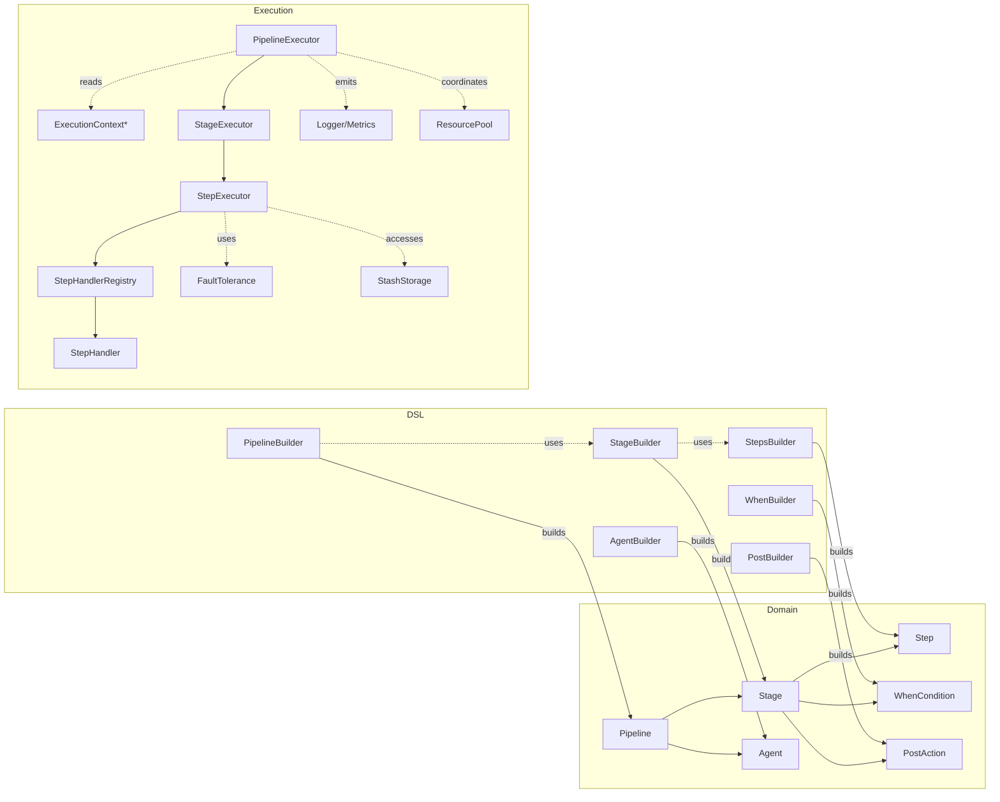

### New SOLID Step Handler Architecture

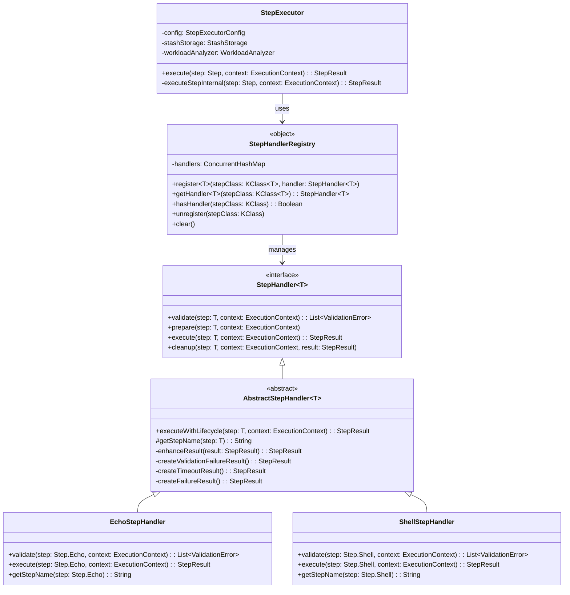

**Key Benefits:**
- **Single Responsibility**: Each handler focuses on one step type
- **Open/Closed**: New step types can be added without modifying existing code
- **Liskov Substitution**: All handlers implement the same interface
- **Interface Segregation**: Clean, focused interfaces
- **Dependency Inversion**: StepExecutor depends on abstractions

## Domain Model

Main classes are in `dev.rubentxu.hodei.core.domain.model`:

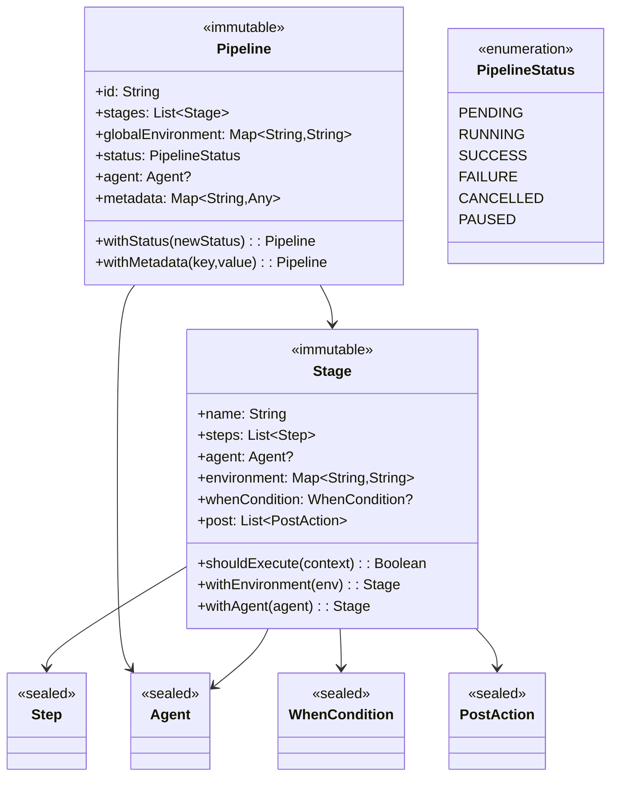

**Supported Step types** (see `Step.kt`): `Shell`, `Echo`, `Dir`, `WithEnv`, `Parallel`, `Retry`, `Timeout`, `ArchiveArtifacts`, `PublishTestResults`, `Stash`, `Unstash`.

**Supported Agents**: `Any`, `None`, `Label`, `Docker(image, args, volumes, environment)`, `Kubernetes(yaml, namespace)`.

**WhenConditions**: `Branch`, `Environment`, `Predicate` (functional), `ChangeSet`, combinators `And/Or/Not`.

## Step Handler System

The new step handler system implements the Strategy Pattern for step execution, following SOLID principles.

### Handler Lifecycle Flow

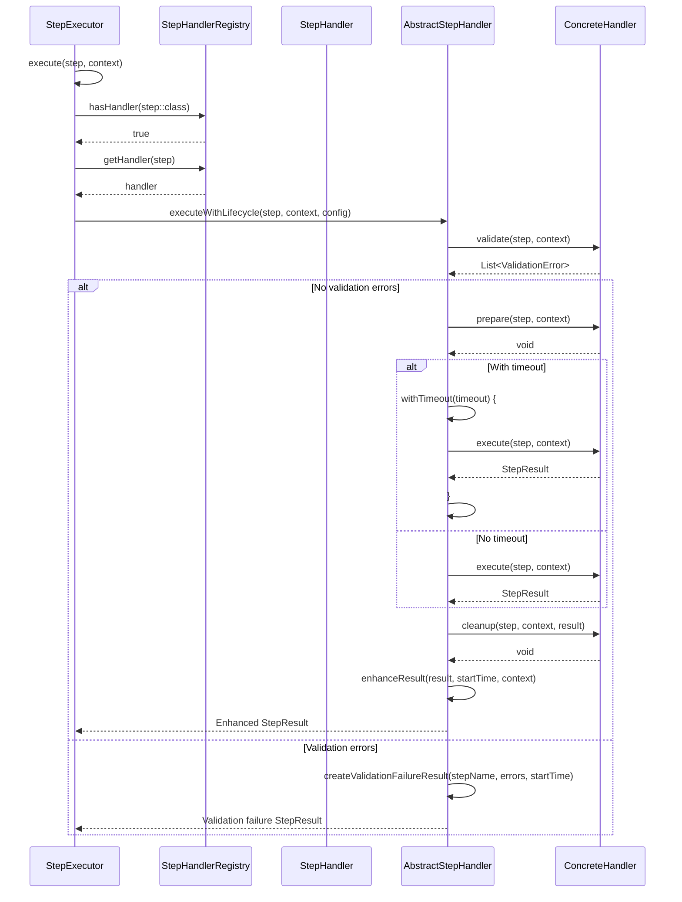

### Currently Implemented Handlers

#### FASE 1: Infrastructure ✅
- `StepHandler<T>` interface
- `StepHandlerRegistry` object
- `AbstractStepHandler` base class
- Integration with `StepExecutor`

#### FASE 2: Simple Handlers ✅
- `EchoStepHandler` - handles `Step.Echo`
- `ShellStepHandler` - handles `Step.Shell`
- `ArchiveArtifactsStepHandler` - handles `Step.ArchiveArtifacts`
- `PublishTestResultsStepHandler` - handles `Step.PublishTestResults`
- `StashStepHandler` - handles `Step.Stash`
- `UnstashStepHandler` - handles `Step.Unstash`

#### FASE 3: Complex Handlers (Pending)
- `DirStepHandler` - for `Step.Dir`
- `WithEnvStepHandler` - for `Step.WithEnv`
- `ParallelStepHandler` - for `Step.Parallel`
- `RetryStepHandler` - for `Step.Retry`
- `TimeoutStepHandler` - for `Step.Timeout`

### Handler Registration

```mermaid
flowchart LR
  A[DefaultHandlerRegistration] --> B[registerDefaultHandlers()]
  B --> C[StepHandlerRegistry.register]
  C --> D[EchoStepHandler]
  C --> E[ShellStepHandler]
  C --> F[ArchiveArtifactsStepHandler]
  C --> G[PublishTestResultsStepHandler]
  C --> H[StashStepHandler]
  C --> I[UnstashStepHandler]
```

## Execution Flow

### Complete Pipeline Execution Flow

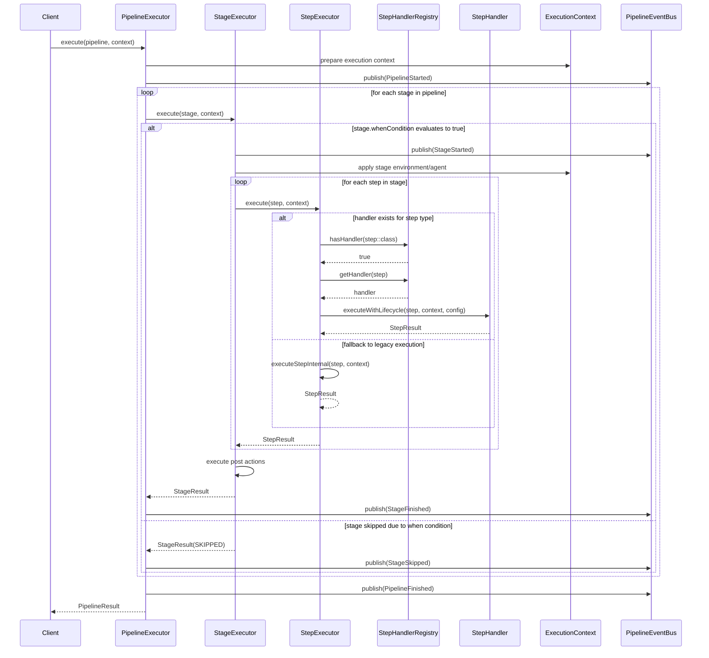

### Step Execution Decision Flow

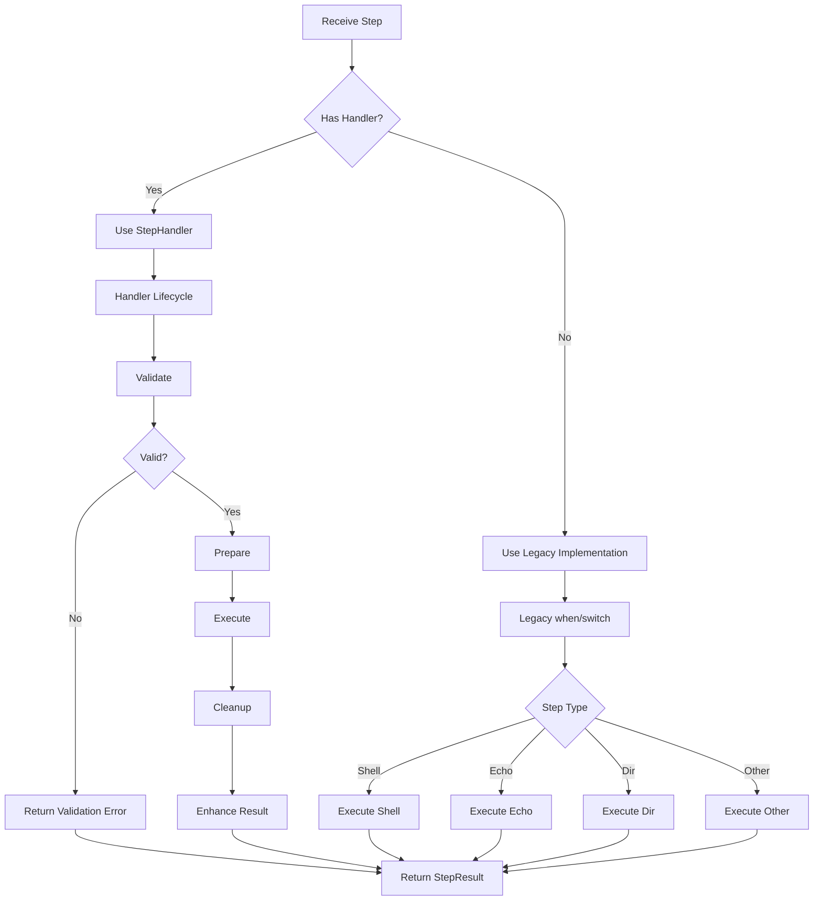

## DSL (Typed Builders)

Package: `dev.rubentxu.hodei.core.dsl.builders`.

- `PipelineBuilder`: defines `agent`, `environment`, `stage`, `post` and builds `Pipeline`.
- `StageBuilder`: defines agent per stage, variables, `when`, `steps`, `post`. Includes shortcut `sh("cmd")` for simple stages.
- `StepsBuilder`: provides step operations: `sh`, `echo`, `dir {}`, `withEnv(List<String>) {}`, `parallel {}`, `retry {}`, `timeout {}`, `archiveArtifacts`, `publishTestResults`, `stash`, `unstash`, `emailext` (helper).
- `WhenBuilder`, `AgentBuilder`, `EnvironmentBuilder`, `PostBuilder`: specialized sub-builders.

### Basic Example

```kotlin
val pipeline = pipeline {
  agent { any() }
  environment {
    set("JAVA_HOME", "/opt/jdk")
  }
  stage("Build") {
    steps {
      sh("./gradlew build")
      archiveArtifacts("build/libs/*.jar", fingerprint = true)
    }
  }
  stage("Test") {
    steps {
      sh("./gradlew test")
      publishTestResults("build/test-results/test/*.xml")
    }
  }
}
```

### DSL Construction Flow

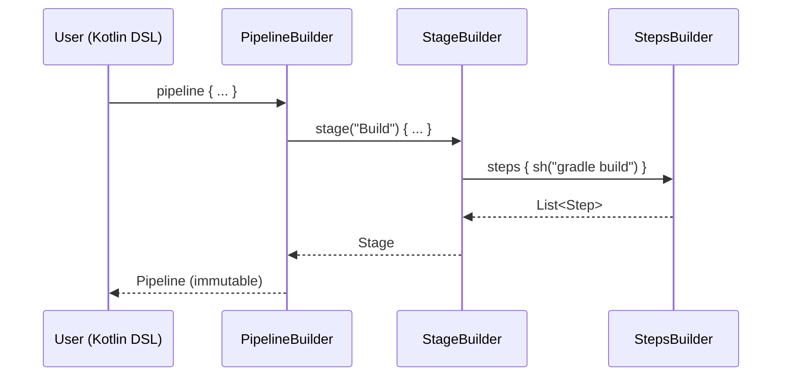

## Step Extension Mechanisms

### Extension by Plugins

Two clearly defined parts:
- **Registration mechanism** (third parties): implements StepExtension with a typed scope and registers via ServiceLoader (META-INF/services) or programmatically for tests.
- **Typed DSL generation** (core): extension functions over StepsBuilder that create the scope and delegate to StepExtensionRegistry.

Contract (core):
```kotlin
interface StepExtension {
  val name: String
  fun createScope(): Any
  fun execute(scope: Any, stepsBuilder: StepsBuilder)
}

object StepExtensionRegistry {
  fun get(name: String): StepExtension?
  fun register(extension: StepExtension)
  fun unregister(name: String)
}

// Support in StepsBuilder for use by generated code
fun StepsBuilder.invokeExtension(name: String, scope: Any)
```

Example generated function:
```kotlin
// In plugin-slack (generated):
class SlackStepScope { var message: String = ""; var channel: String = "#general" }

fun StepsBuilder.slack(block: SlackStepScope.() -> Unit) {
  val scope = SlackStepScope().apply(block)
  invokeExtension("slack", scope)
}
```

### Extension Patterns

1. **DSL Sugar via extension functions** (without creating new Step types)
2. **New Step types** (deep integration)
3. **Plugins** (extension outside core)

## Pipeline Execution

The execution engine in `dev.rubentxu.hodei.core.execution` orchestrates concurrent and fault-tolerant execution.

### Main Components

- `ExecutionContext`, `ExecutionContextFactory`, `ExecutionContextBuilder`: encapsulate environment, variables, workspace and utilities for execution.
- `PipelineExecutor`: coordinates stages, applies global timeouts and publishes events.
- `StageExecutor`: evaluates `whenCondition`, applies `agent/environment` and executes stage steps.
- `StepExecutor`: executes each `Step` with validations, dispatcher selection (CPU/IO), timeouts, retries, parallelism, stash/unstash, junit/artifacts, etc.
- `FaultTolerance` and `FaultToleranceConfig`: backoff, retries and graceful degradation.
- `PipelineLogger` and `ConfigurablePipelineLogger`: structured logging by levels.
- `PipelineMetrics`: latencies, counters and states per stage/step.
- `ResourcePool`: concurrency control and permits.
- `StashStorage` (e.g., `FileSystemStashStorage`): temporary artifact persistence between stages.

### Execution Sequence Diagram

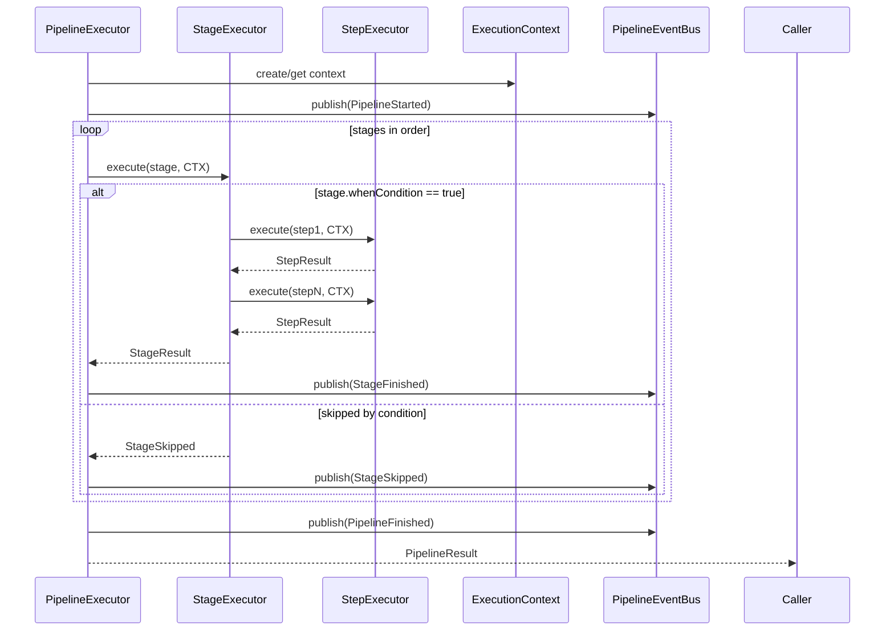

### Fault Tolerance and Degradation

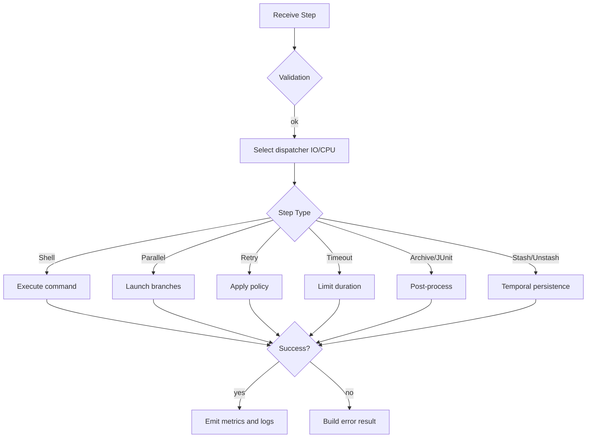

## Testing

### Framework and Structure

- **Framework**: Kotest 5 + JUnit Platform, with tests in `core/src/test/kotlin`.
- **Test Categories**:
  - Domain tests: `PipelineModelSpec`, `WhenConditionSpec`
  - DSL tests: `DSLBuilderSpec`
  - Execution tests: `ExecutionContextSpec`, `StashSystemSpec`
  - Handler tests: `EchoStepHandlerSpec`, `HandlerRegistrationSpec`
  - Integration tests: `PipelineDSLGradleBuildSpec`

### Handler Testing Strategy

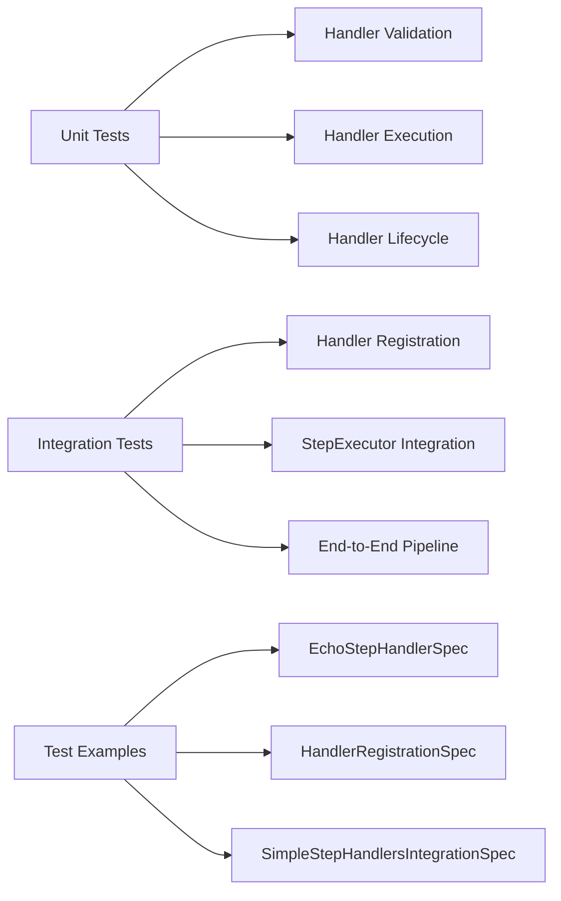

### Running Tests

```bash
# Core module only
gradle :core:test

# Specific test
gradle :core:test --tests "dev.rubentxu.hodei.core.execution.handlers.EchoStepHandlerSpec"

# Handler tests only
gradle :core:test --tests "*Handler*"
```

## Integration with Other Modules

- `:execution`: contains additional execution implementations and tests; shares concepts with core but focused on runtime scenarios.
- `:compiler`: integration with scripting and Tooling API to compile pipelines `.kts` and resolve dependencies.
- `:steps` and `:plugins`: extension of the ecosystem of steps and plugins.
- `:cli` and `:library`: packaging and programmatic/CLI access.

### Module Dependencies

The core module maintains minimal dependencies to preserve domain purity:
- Kotlin stdlib and coroutines
- kotlinx-serialization for JSON support (where applicable)

### Cross-Module Interaction

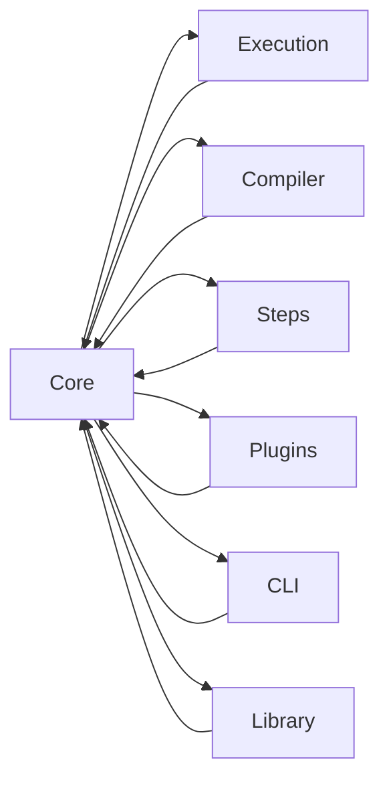

## References

- Repository documentation in `docs/`:
  - `docs/architecture.md` – global architecture vision
  - `docs/execution-model.md` – execution model detail
  - `docs/dsl-specification.md` – DSL specification
  - `docs/plugin-system.md` – plugin system
  - `docs/examples/*` – practical examples

## Contributing

When contributing to the core module:

1. **Domain changes**: Ensure immutability and add appropriate tests
2. **DSL changes**: Maintain type safety and add builder tests
3. **Execution changes**: Follow SOLID principles and add handler tests
4. **New step types**: Consider handler implementation following the established pattern

## Changelog (Core Capabilities Summary)

- ✅ Immutable domain with Pipeline/Stage/Step and When/Post/Agent
- ✅ Typed DSL with DslMarkers for safe composition
- ✅ SOLID step handler system with Strategy Pattern
- ✅ Executors with support for parallel/retry/timeout, stash, artifacts and junit
- ✅ Configurable metrics, events and logger
- ✅ ResourcePool and fault tolerance with backoff
- ✅ Simple step handlers: Echo, Shell, ArchiveArtifacts, PublishTestResults, Stash, Unstash
- ⏳ Complex step handlers: Dir, WithEnv, Parallel, Retry, Timeout (FASE 3)
- ⏳ Context receivers modernization (FASE 4)
- ⏳ Legacy code cleanup (FASE 5)