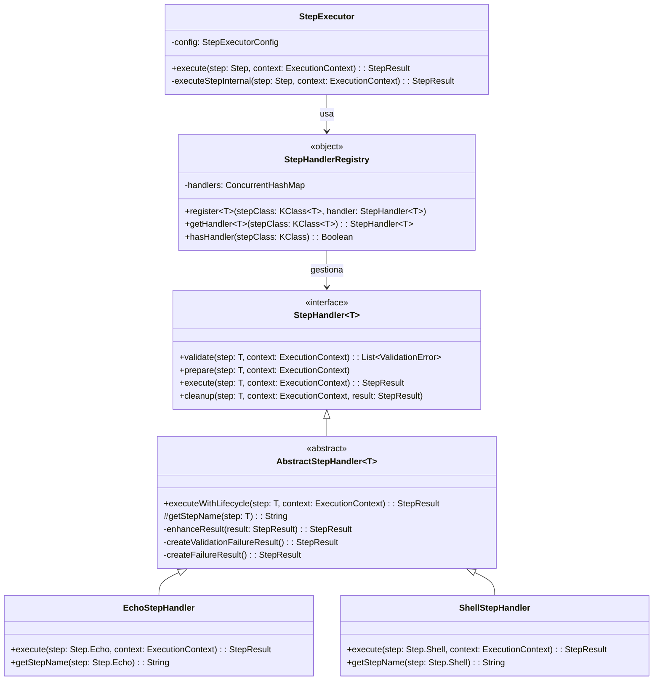

# Arquitectura General - Hodei Pipeline DSL

## Visión General del Sistema

Hodei Pipeline DSL es un sistema de pipelines de CI/CD diseñado con **Arquitectura Hexagonal**, implementado en **Kotlin** con **type-safety completa** y **ejecución paralela real** usando coroutines.

## Principios Arquitecturales

### 🏗️ Arquitectura Hexagonal (Ports & Adapters)
```
┌─────────────────────────────────────────────┐
│                  ADAPTERS                   │
│  ┌─────────┐  ┌─────────┐  ┌─────────┐     │
│  │   CLI   │  │   Web   │  │ Library │     │
│  │ Adapter │  │ Adapter │  │ Adapter │     │
│  └─────────┘  └─────────┘  └─────────┘     │
│                     │                       │
│ ┌───────────────────┼───────────────────┐   │
│ │               PORTS                   │   │
│ │  ┌─────────────────────────────────┐  │   │
│ │  │        DOMAIN  CORE             │  │   │
│ │  │                                 │  │   │
│ │  │  ┌─────────┐  ┌─────────────┐  │  │   │
│ │  │  │Pipeline │  │   Steps     │  │  │   │
│ │  │  │   DSL   │  │  Registry   │  │  │   │
│ │  │  └─────────┘  └─────────────┘  │  │   │
│ │  │                                 │  │   │
│ │  │  ┌─────────┐  ┌─────────────┐  │  │   │
│ │  │  │ Engine  │  │   Plugin    │  │  │   │
│ │  │  │  Core   │  │   System    │  │  │   │
│ │  │  └─────────┘  └─────────────┘  │  │   │
│ │  └─────────────────────────────────┘  │   │
│ │                     │                 │   │
│ └─────────────────────┼─────────────────┘   │
│                       │                     │
│  ┌─────────┐  ┌───────┼───┐  ┌─────────┐   │
│  │ Docker  │  │   File    │  │ Kubernetes│   │
│  │Executor │  │  System   │  │ Executor  │   │
│  └─────────┘  └───────────┘  └─────────┘   │
│                INFRASTRUCTURE               │
└─────────────────────────────────────────────┘
```

### 🎯 Principios SOLID
- **Single Responsibility**: Cada clase tiene una única razón para cambiar
- **Open/Closed**: Extensible via plugins sin modificar código existente  
- **Liskov Substitution**: Steps intercambiables según interfaz común
- **Interface Segregation**: Interfaces específicas por responsabilidad
- **Dependency Inversion**: Dependencias hacia abstracciones, no implementaciones

### 🧱 Clean Architecture
- **Dominio Central**: Lógica de negocio pura sin dependencias externas
- **Casos de Uso**: Orquestación de entidades del dominio
- **Interfaces de Repositorio**: Contratos para persistencia
- **Implementaciones Externas**: Adapters que implementan interfaces

## Estructura Modular

### 📦 Organización de Módulos

```
hodei-dsl/
├── core/                           # 🎯 Dominio Central
│   ├── api/                        # Interfaces públicas
│   ├── domain/                     # Entidades de dominio
│   ├── engine/                     # Motor de ejecución
│   └── dsl/                        # DSL builders
├── compiler/                       # 🔧 Compilación de Scripts
│   ├── api/                        # Interfaces de compilación
│   ├── kotlin-script/              # Engine Kotlin Scripts
│   └── cache/                      # Sistema de cache
├── steps/                          # 📝 Implementación de Steps
│   ├── basic/                      # sh, echo, dir, etc.
│   ├── scm/                        # Git, SVN, etc.
│   ├── docker/                     # Docker steps
│   └── testing/                    # JUnit, archiving, etc.
├── plugins/                        # 🔌 Sistema de Plugins
│   ├── api/                        # Plugin contracts
│   ├── loader/                     # Dynamic loading
│   └── codegen/                    # DSL generation
├── execution/                      # 🚀 Motor de Ejecución
│   ├── context/                    # Contextos de ejecución
│   ├── parallel/                   # Manejo de paralelismo
│   └── agents/                     # Docker, K8s agents
├── cli/                            # 💻 Command Line Interface
├── library/                        # 📚 Embedded API
│   ├── sync/                       # API síncrona
│   ├── async/                      # API asíncrona
│   └── reactive/                   # Reactive Streams
└── examples/                       # 💡 Ejemplos y demos
```

## Componentes Principales

### 1. 🎯 Core Domain

#### Pipeline DSL
```kotlin
@DslMarker
annotation class PipelineDSL

@PipelineDSL
class Pipeline(val context: ExecutionContext) {
    private val stages = mutableListOf<Stage>()
    
    fun stage(name: String, block: StageBuilder.() -> Unit)
    fun parallel(branches: ParallelBuilder.() -> Unit)
    suspend fun execute(): PipelineResult
}

interface PipelineStep {
    suspend fun execute(context: ExecutionContext): StepResult
}

data class ExecutionContext(
    val workDir: Path,
    val environment: Map<String, String>,
    val logger: PipelineLogger
)
```

#### Domain Entities
```kotlin
// Entidades centrales del dominio
sealed class Stage {
    abstract val name: String
    abstract val steps: List<PipelineStep>
}

data class SequentialStage(
    override val name: String,
    override val steps: List<PipelineStep>,
    val agent: Agent? = null
) : Stage()

data class ParallelStage(
    override val name: String,
    val branches: List<Branch>
) : Stage() {
    override val steps: List<PipelineStep>
        get() = branches.flatMap { it.steps }
}

data class Branch(
    val name: String,
    val steps: List<PipelineStep>
)
```

### 2. 🔧 Compilation System

#### Script Engine Integration
```kotlin
interface ScriptCompiler {
    suspend fun compile(script: String): CompiledPipeline
    suspend fun evaluate(compiled: CompiledPipeline): Pipeline
    fun invalidateCache()
}

class KotlinScriptCompiler(
    private val config: ScriptCompilationConfiguration,
    private val cache: CompilationCache
) : ScriptCompiler {
    
    private val engine = BasicJvmScriptingHost()
    
    override suspend fun compile(script: String): CompiledPipeline {
        // Implementación con cache y optimizaciones
    }
}
```

### 3. 🚀 Execution Engine

#### Coroutine-Based Executor
```kotlin
class PipelineExecutor(
    private val config: ExecutorConfig
) {
    private val scope = CoroutineScope(SupervisorJob() + Dispatchers.Default)
    
    suspend fun execute(pipeline: Pipeline): PipelineResult = coroutineScope {
        // Structured concurrency para stages paralelos
        val stageResults = pipeline.stages.map { stage ->
            when (stage) {
                is ParallelStage -> executeParallelStage(stage)
                is SequentialStage -> executeSequentialStage(stage)
            }
        }
        
        PipelineResult(stageResults)
    }
    
    private suspend fun executeParallelStage(
        stage: ParallelStage
    ): StageResult = coroutineScope {
        // Ejecución paralela real con coroutines
        stage.branches.map { branch ->
            async(CoroutineName(branch.name)) {
                executeBranch(branch)
            }
        }.awaitAll()
    }
}
```

### 4. 🔌 Plugin System

#### Dynamic Plugin Loading
```kotlin
interface PipelinePlugin<T : PluginAware> {
    fun apply(target: T)
    fun getExtensionSchema(): ExtensionSchema
}

class PluginManager {
    private val pluginLoaders = ConcurrentHashMap<String, PluginClassLoader>()
    
    suspend fun loadPlugin(pluginJar: File): PluginDescriptor {
        // ClassLoader isolation y generación de DSL
        val classLoader = createIsolatedClassLoader(pluginJar)
        val plugin = loadPluginClass(classLoader)
        generateDSLBindings(plugin.getExtensionSchema())
        return PluginDescriptor(plugin)
    }
}
```

## Patrones de Diseño Aplicados

### 🏗️ Builder Pattern
```kotlin
class StageBuilder {
    fun steps(block: StepsBuilder.() -> Unit)
    fun agent(block: AgentBuilder.() -> Unit)  
    fun post(block: PostBuilder.() -> Unit)
    fun build(): Stage
}
```

### 🏭 Factory Pattern
```kotlin
interface StepFactory {
    fun createStep(type: StepType, config: StepConfig): PipelineStep
}

class DefaultStepFactory : StepFactory {
    override fun createStep(type: StepType, config: StepConfig): PipelineStep {
        return when (type) {
            StepType.SHELL -> ShellStep(config.command)
            StepType.DOCKER -> DockerStep(config.image, config.command)
            // etc...
        }
    }
}
```

### 📋 Strategy Pattern

#### SOLID Step Handler System (Implementado)

```kotlin
/**
 * Patrón Strategy para ejecución de steps con SOLID principles
 */
interface StepHandler<T : Step> {
    fun validate(step: T, context: ExecutionContext): List<ValidationError>
    suspend fun prepare(step: T, context: ExecutionContext)
    suspend fun execute(step: T, context: ExecutionContext): StepResult
    suspend fun cleanup(step: T, context: ExecutionContext, result: StepResult)
}

/**
 * Template Method Pattern para lifecycle común
 */
abstract class AbstractStepHandler<T : Step> : StepHandler<T> {
    suspend fun executeWithLifecycle(step: T, context: ExecutionContext): StepResult {
        val startTime = Instant.now()
        val stepName = getStepName(step)
        
        // Validación
        val validationErrors = validate(step, context)
        if (validationErrors.isNotEmpty()) {
            return createValidationFailureResult(stepName, validationErrors, startTime)
        }
        
        try {
            // Preparación
            prepare(step, context)
            
            // Ejecución
            val result = execute(step, context)
            
            // Limpieza
            cleanup(step, context, result)
            
            return enhanceResult(result, startTime, context)
        } catch (e: Exception) {
            return createFailureResult(stepName, e, startTime)
        }
    }
    
    protected abstract fun getStepName(step: T): String
    // ... métodos auxiliares
}

/**
 * Registry Pattern para gestión de handlers
 */
object StepHandlerRegistry {
    private val handlers = ConcurrentHashMap<KClass<out Step>, StepHandler<*>>()
    
    fun <T : Step> register(stepClass: KClass<T>, handler: StepHandler<T>) {
        handlers[stepClass] = handler
    }
    
    @Suppress("UNCHECKED_CAST")
    fun <T : Step> getHandler(stepClass: KClass<T>): StepHandler<T>? {
        return handlers[stepClass] as? StepHandler<T>
    }
}

/**
 * Implementaciones concretas
 */
class EchoStepHandler : AbstractStepHandler<Step.Echo>() {
    override suspend fun execute(step: Step.Echo, context: ExecutionContext): StepResult {
        context.logger.info(step.message)
        return StepResult.success()
    }
    
    override fun getStepName(step: Step.Echo): String = "echo"
}

class ShellStepHandler : AbstractStepHandler<Step.Shell>() {
    override suspend fun execute(step: Step.Shell, context: ExecutionContext): StepResult {
        return context.launcher.execute(step.command)
    }
    
    override fun getStepName(step: Step.Shell): String = "sh"
}
```

#### Arquitectura SOLID Aplicada



**Beneficios SOLID Logrados:**
- **Single Responsibility**: Cada handler maneja un solo tipo de step
- **Open/Closed**: Nuevos steps sin modificar código existente
- **Liskov Substitution**: Todos los handlers intercambiables vía interfaz común
- **Interface Segregation**: Interfaces específicas y enfocadas
- **Dependency Inversion**: StepExecutor depende de abstracciones

#### Strategy Pattern para Ejecución Paralela

```kotlin
interface ExecutionStrategy {
    suspend fun execute(steps: List<PipelineStep>, context: ExecutionContext): List<StepResult>
}

class ParallelExecutionStrategy : ExecutionStrategy {
    override suspend fun execute(
        steps: List<PipelineStep>, 
        context: ExecutionContext
    ): List<StepResult> = coroutineScope {
        steps.map { step ->
            async { step.execute(context) }
        }.awaitAll()
    }
}
```

### 👁️ Observer Pattern (Event Bus)
```kotlin
sealed class PipelineEvent {
    object PipelineStarted : PipelineEvent()
    data class StageStarted(val stageName: String) : PipelineEvent()
    data class StageCompleted(val stageName: String, val result: StageResult) : PipelineEvent()
    data class PipelineCompleted(val result: PipelineResult) : PipelineEvent()
}

interface EventBus {
    suspend fun publish(event: PipelineEvent)
    fun subscribe(handler: (PipelineEvent) -> Unit)
}
```

## Concurrencia y Paralelismo

### 🔄 Structured Concurrency
```kotlin
// Cada stage maneja sus propias coroutines
suspend fun executeStage(stage: Stage): StageResult = coroutineScope {
    // Todas las coroutines son canceladas si una falla
    supervisorScope {
        when (stage) {
            is ParallelStage -> {
                stage.branches.map { branch ->
                    async(CoroutineName(branch.name)) {
                        executeBranch(branch)
                    }
                }.awaitAll()
            }
            is SequentialStage -> {
                executeSequential(stage)
            }
        }
    }
}
```

### 🎛️ Dispatchers Especializados
```kotlin
class ExecutorConfig {
    val cpuDispatcher = Dispatchers.Default
    val ioDispatcher = Dispatchers.IO.limitedParallelism(64)
    val blockingDispatcher = newFixedThreadPoolContext(16, "blocking-pool")
    
    fun selectDispatcher(workload: WorkloadType): CoroutineDispatcher {
        return when (workload) {
            WorkloadType.CPU_INTENSIVE -> cpuDispatcher
            WorkloadType.IO_INTENSIVE -> ioDispatcher  
            WorkloadType.BLOCKING -> blockingDispatcher
        }
    }
}
```

## Seguridad y Sandboxing

### 🔒 ClassLoader Isolation
```kotlin
class PluginClassLoader(
    urls: Array<URL>,
    parent: ClassLoader,
    private val pluginId: String
) : URLClassLoader(urls, parent) {
    
    override fun loadClass(name: String): Class<*> {
        // Plugin-first loading con restricciones de seguridad
        if (isRestrictedClass(name)) {
            throw SecurityException("Plugin $pluginId cannot access $name")
        }
        return super.loadClass(name)
    }
}
```

### 🛡️ Execution Sandboxing
```kotlin
class SandboxedExecutionContext(
    private val baseContext: ExecutionContext,
    private val restrictions: SecurityRestrictions
) : ExecutionContext {
    
    override val workDir: Path
        get() = restrictions.validatePath(baseContext.workDir)
        
    override val environment: Map<String, String>
        get() = restrictions.filterEnvironment(baseContext.environment)
}
```

## Extensibilidad

### 🔧 Extension Points
```kotlin
// Punto de extensión para nuevos tipos de steps
interface StepExtension {
    fun registerStepType(type: String, factory: StepFactory)
}

// Punto de extensión para nuevos agentes de ejecución  
interface AgentExtension {
    fun registerAgentType(type: String, factory: AgentFactory)
}

// Punto de extensión para hooks de lifecycle
interface LifecycleExtension {
    fun beforeStageExecution(stage: Stage, context: ExecutionContext)
    fun afterStageExecution(stage: Stage, result: StageResult)
}
```

### 📈 Métricas y Observabilidad
```kotlin
interface PipelineMetrics {
    fun recordStageExecution(stageName: String, duration: Duration, result: StageResult)
    fun recordStepExecution(stepType: String, duration: Duration, result: StepResult)
    fun incrementPipelineCount()
    fun recordPipelineError(error: Throwable)
}

class PrometheusPipelineMetrics : PipelineMetrics {
    private val stageExecutionTime = Timer.builder("pipeline.stage.execution.time")
        .register(Metrics.globalRegistry)
        
    private val pipelineCounter = Counter.builder("pipeline.executions.total")
        .register(Metrics.globalRegistry)
}
```

## Compatibilidad

### 🔄 Jenkins API Compatibility
```kotlin
// Mantiene compatibilidad sintáctica con Jenkins
interface JenkinsCompatible {
    // Mismo nombre y comportamiento que Jenkins
    fun sh(script: String, returnStdout: Boolean = false): String?
    fun echo(message: String)
    fun dir(path: String, block: () -> Unit)
    fun parallel(branches: Map<String, () -> Unit>)
    fun retry(times: Int, block: () -> Unit)
}
```

### 📡 Integration APIs
```kotlin
// API para integración con sistemas externos
interface IntegrationAPI {
    suspend fun triggerPipeline(script: String): PipelineResult
    suspend fun getPipelineStatus(id: String): PipelineStatus
    suspend fun cancelPipeline(id: String): Boolean
    fun streamPipelineLogs(id: String): Flow<LogEntry>
}
```

## Estrategia de Testing

### 🧪 Testing Architecture
```kotlin
// Tests de dominio puros sin dependencias externas
class PipelineSpec : BehaviorSpec({
    given("a pipeline with sequential stages") {
        `when`("executing all stages") {
            then("should complete successfully") {
                // Test de dominio puro
            }
        }
    }
})

// Tests de integración con componentes reales
class IntegrationSpec : FunSpec({
    test("should execute docker-based pipeline end-to-end") {
        // Test de integración completo
    }
})
```

---

## Estado de Implementación del Sistema SOLID

### ✅ FASE 1: Infrastructure (Completada)
- **StepHandler<T>** interface implementada
- **AbstractStepHandler<T>** base class creada
- **StepHandlerRegistry** object funcional
- **Integración con StepExecutor** completada

### ✅ FASE 2: Handlers Simples (Completada)
- **EchoStepHandler** - maneja `Step.Echo`
- **ShellStepHandler** - maneja `Step.Shell`
- **ArchiveArtifactsStepHandler** - maneja `Step.ArchiveArtifacts`
- **PublishTestResultsStepHandler** - maneja `Step.PublishTestResults`
- **StashStepHandler** - maneja `Step.Stash`
- **UnstashStepHandler** - maneja `Step.Unstash`

### ⏳ FASE 3: Handlers Complejos (Pendiente)
- **DirStepHandler** - para `Step.Dir`
- **WithEnvStepHandler** - para `Step.WithEnv`
- **ParallelStepHandler** - para `Step.Parallel`
- **RetryStepHandler** - para `Step.Retry`
- **TimeoutStepHandler** - para `Step.Timeout`

### ⏳ FASE 4: Modernización DSL (Pendiente)
- Context receivers para DSL moderno
- Mejoras en type safety

### ⏳ FASE 5: Cleanup Legacy (Pendiente)
- Eliminación de código legacy en StepExecutor
- Migración completa a sistema de handlers

---

Esta arquitectura proporciona:
- **🎯 Separación clara de responsabilidades**
- **🔧 Extensibilidad máxima via plugins**
- **🚀 Performance óptimo con coroutines** 
- **🛡️ Seguridad con sandboxing**
- **🧪 Testabilidad completa**
- **🔄 Compatibilidad total con Jenkins**
- **✨ Arquitectura SOLID implementada** (FASE 1-2 ✅)