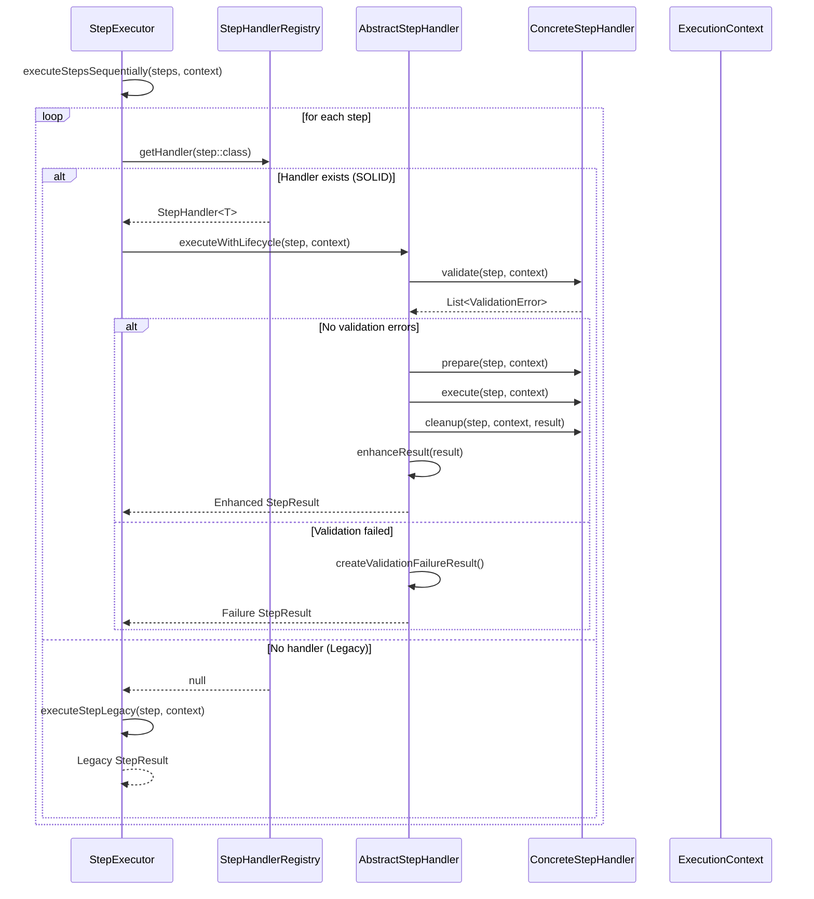
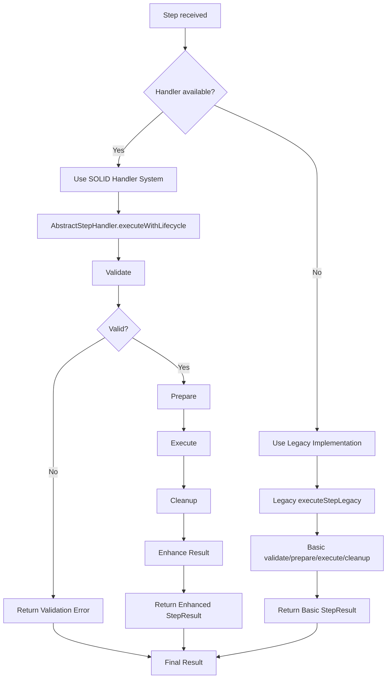

# Modelo de Ejecución y Concurrencia - Hodei Pipeline DSL

## Resumen Ejecutivo

El modelo de ejecución de Hodei Pipeline DSL se basa en **Kotlin Coroutines** con **Structured Concurrency**, proporcionando **paralelismo real**, **manejo robusto de errores**, y **cancelación cooperativa**. El sistema optimiza automáticamente la ejecución según el tipo de workload y recursos disponibles.

## Principios Arquitecturales

### 🏗️ **Structured Concurrency**
- **Scope Hierarchy**: Cada stage maneja sus propias coroutines
- **Automatic Cancellation**: Cancelación automática de child coroutines  
- **Error Propagation**: Propagación controlada de excepciones
- **Resource Safety**: Cleanup automático de recursos

### ⚡ **Performance Optimization**
- **Dispatcher Selection**: Dispatchers especializados por workload
- **Load Balancing**: Distribución automática de carga
- **Resource Pooling**: Reutilización eficiente de recursos
- **Lazy Evaluation**: Construcción diferida de pipelines

### 🛡️ **Fault Tolerance**
- **Graceful Degradation**: Manejo inteligente de fallos
- **Timeout Management**: Timeouts configurables por nivel
- **Retry Strategies**: Reintentos con backoff exponencial
- **Circuit Breaker**: Protección contra cascading failures

## Arquitectura de Concurrencia

### 1. **Hierarchy de Coroutine Scopes**

```
┌─────────────────────────────────────────────┐
│            PIPELINE SCOPE                   │
├─────────────────────────────────────────────┤
│  ┌─────────────┐  ┌─────────────────────┐   │
│  │  STAGE 1    │  │     STAGE 2         │   │ 
│  │   SCOPE     │  │  (PARALLEL SCOPE)   │   │
│  └─────────────┘  └─────────────────────┘   │
│         │                    │               │
│    ┌─────────┐      ┌─────────┐ ┌─────────┐ │
│    │ Step 1  │      │Branch A │ │Branch B │ │
│    │ Step 2  │      │ Scope   │ │ Scope   │ │
│    │ Step 3  │      └─────────┘ └─────────┘ │
│    └─────────┘              │         │     │
│                     ┌─────────┐ ┌─────────┐ │
│                     │ Step A1 │ │ Step B1 │ │ 
│                     │ Step A2 │ │ Step B2 │ │
│                     └─────────┘ └─────────┘ │
└─────────────────────────────────────────────┘
```

### 2. **Dispatcher Strategy**

#### Specialized Dispatchers
```kotlin
/**
 * Configuración de dispatchers optimizados por tipo de workload
 */
class ExecutorDispatcherConfig {
    
    /**
     * Dispatcher para operaciones CPU-intensive
     * Optimizado para cálculos y procesamiento
     */
    val cpuDispatcher: CoroutineDispatcher = Dispatchers.Default
    
    /**
     * Dispatcher para operaciones I/O intensive  
     * Optimizado para network, file system, database
     */
    val ioDispatcher: CoroutineDispatcher = Dispatchers.IO.limitedParallelism(128)
    
    /**
     * Dispatcher para operaciones blocking
     * Para código legacy que bloquea threads
     */
    val blockingDispatcher: CoroutineDispatcher = newFixedThreadPoolContext(
        nThreads = maxOf(64, Runtime.getRuntime().availableProcessors() * 4),
        name = "blocking-pool"
    )
    
    /**
     * Dispatcher para tareas de sistema
     * Para operaciones de management y monitoring
     */
    val systemDispatcher: CoroutineDispatcher = newSingleThreadContext("system")
    
    /**
     * Dispatcher para operaciones de red
     * Especializado para HTTP calls, gRPC, etc.
     */
    val networkDispatcher: CoroutineDispatcher = Dispatchers.IO.limitedParallelism(256)
    
    /**
     * Selección automática de dispatcher según workload
     */
    fun selectDispatcher(workload: WorkloadType): CoroutineDispatcher {
        return when (workload) {
            WorkloadType.CPU_INTENSIVE -> cpuDispatcher
            WorkloadType.IO_INTENSIVE -> ioDispatcher
            WorkloadType.BLOCKING -> blockingDispatcher
            WorkloadType.NETWORK -> networkDispatcher
            WorkloadType.SYSTEM -> systemDispatcher
            WorkloadType.DEFAULT -> Dispatchers.Default
        }
    }
}

/**
 * Tipos de workload para optimización de dispatcher
 */
enum class WorkloadType {
    CPU_INTENSIVE,    // Compilación, cálculos, procesamiento de datos
    IO_INTENSIVE,     // File operations, database queries
    BLOCKING,         // Legacy code que bloquea threads
    NETWORK,          // HTTP calls, API requests, downloads
    SYSTEM,           // Management operations, logging
    DEFAULT           // Workload general
}
```

### 3. **Pipeline Executor Core**

#### Main Execution Engine
```kotlin
/**
 * Motor principal de ejecución de pipelines
 * Implementa structured concurrency y manejo avanzado de errores
 */
class PipelineExecutor(
    private val config: ExecutorConfig = ExecutorConfig.default()
) {
    
    private val dispatcherConfig = ExecutorDispatcherConfig()
    
    // Supervisor job para manejar failures de manera controlada
    private val supervisorJob = SupervisorJob()
    
    // Scope principal con manejo de excepciones
    private val executorScope = CoroutineScope(
        supervisorJob + 
        dispatcherConfig.systemDispatcher +
        CoroutineExceptionHandler { _, exception ->
            logger.error("Unhandled exception in pipeline executor", exception)
            metrics.recordError("executor", exception)
        }
    )
    
    /**
     * Ejecuta pipeline completo con structured concurrency
     */
    suspend fun execute(pipeline: Pipeline): PipelineResult = withContext(NonCancellable) {
        val executionId = UUID.randomUUID().toString()
        val startTime = Instant.now()
        
        logger.info("Starting pipeline execution", mapOf("executionId" to executionId))
        
        try {
            // Event bus para comunicación entre stages
            val eventBus = Channel<PipelineEvent>(Channel.UNLIMITED)
            
            // Contexto de ejecución con recursos compartidos
            val executionContext = pipeline.context.copy(executionId = executionId)
            
            // Ejecutar con timeout global si está configurado
            val result = if (config.globalTimeout != null) {
                withTimeout(config.globalTimeout.toMillis()) {
                    executeStagesSequentially(pipeline.stages, executionContext, eventBus)
                }
            } else {
                executeStagesSequentially(pipeline.stages, executionContext, eventBus)
            }
            
            // Ejecutar post actions
            executePostActions(pipeline.postActions, executionContext, result)
            
            val duration = Duration.between(startTime, Instant.now())
            
            PipelineResult(
                executionId = executionId,
                status = determineStatus(result),
                stages = result,
                duration = duration,
                startedAt = startTime,
                finishedAt = Instant.now(),
                metadata = buildResultMetadata(pipeline, executionContext)
            ).also { pipelineResult ->
                logger.info("Pipeline execution completed", 
                    mapOf(
                        "executionId" to executionId,
                        "status" to pipelineResult.status.name,
                        "duration" to duration.toString()
                    )
                )
                metrics.recordPipelineExecution(pipelineResult)
            }
            
        } catch (e: CancellationException) {
            logger.info("Pipeline execution cancelled", mapOf("executionId" to executionId))
            throw e
        } catch (e: Exception) {
            logger.error("Pipeline execution failed", e, mapOf("executionId" to executionId))
            metrics.recordPipelineFailure(executionId, e)
            throw PipelineExecutionException("Pipeline execution failed", e)
        }
    }
    
    /**
     * Ejecuta stages en secuencia respetando dependencias
     */
    private suspend fun executeStagesSequentially(
        stages: List<Stage>,
        context: ExecutionContext,
        eventBus: Channel<PipelineEvent>
    ): List<StageResult> = coroutineScope {
        
        val results = mutableListOf<StageResult>()
        
        for ((index, stage) in stages.withIndex()) {
            eventBus.send(PipelineEvent.StageStarted(stage.name, index))
            
            val stageResult = when (stage) {
                is SequentialStage -> executeSequentialStage(stage, context, eventBus)
                is ParallelStage -> executeParallelStage(stage, context, eventBus)
                is ConditionalStage -> executeConditionalStage(stage, context, eventBus)
            }
            
            results.add(stageResult)
            eventBus.send(PipelineEvent.StageCompleted(stage.name, stageResult))
            
            // Verificar si debemos continuar basado en el resultado
            if (stageResult.status == StageStatus.FAILURE && stage.failFast) {
                logger.warn("Stage ${stage.name} failed with fail-fast enabled, stopping execution")
                break
            }
            
            if (stageResult.status == StageStatus.CANCELLED) {
                logger.info("Stage ${stage.name} was cancelled, stopping execution")
                break
            }
        }
        
        results
    }
    
    /**
     * Ejecuta stage secuencial
     */
    private suspend fun executeSequentialStage(
        stage: SequentialStage,
        context: ExecutionContext,
        eventBus: Channel<PipelineEvent>
    ): StageResult = withContext(selectStageDispatcher(stage)) {
        
        val stageStartTime = Instant.now()
        val stageContext = prepareStageContext(stage, context)
        
        try {
            // Aplicar timeout específico del stage si existe
            val stageResult = if (stage.timeout != null) {
                withTimeout(stage.timeout.toMillis()) {
                    executeStepsSequentially(stage.steps, stageContext)
                }
            } else {
                executeStepsSequentially(stage.steps, stageContext)
            }
            
            val duration = Duration.between(stageStartTime, Instant.now())
            
            StageResult(
                stageName = stage.name,
                status = if (stageResult.all { it.isSuccess }) StageStatus.SUCCESS else StageStatus.FAILURE,
                steps = stageResult,
                duration = duration,
                agent = stage.agent,
                metadata = mapOf(
                    "dispatcher" to currentCoroutineContext()[CoroutineDispatcher]?.toString(),
                    "thread" to Thread.currentThread().name
                )
            )
            
        } catch (e: TimeoutCancellationException) {
            logger.warn("Stage ${stage.name} timed out after ${stage.timeout}")
            StageResult(
                stageName = stage.name,
                status = StageStatus.TIMEOUT,
                steps = emptyList(),
                duration = Duration.between(stageStartTime, Instant.now()),
                agent = stage.agent,
                error = e
            )
        } catch (e: CancellationException) {
            logger.info("Stage ${stage.name} was cancelled")
            throw e // Re-throw para cancelación cooperativa
        } catch (e: Exception) {
            logger.error("Stage ${stage.name} failed", e)
            StageResult(
                stageName = stage.name,
                status = StageStatus.FAILURE,
                steps = emptyList(),
                duration = Duration.between(stageStartTime, Instant.now()),
                agent = stage.agent,
                error = e
            )
        } finally {
            // Cleanup del stage context
            cleanupStageContext(stage, stageContext)
        }
    }
    
    /**
     * Ejecuta stage paralelo con structured concurrency
     */
    private suspend fun executeParallelStage(
        stage: ParallelStage,
        context: ExecutionContext,
        eventBus: Channel<PipelineEvent>
    ): StageResult = coroutineScope {
        
        val stageStartTime = Instant.now()
        
        try {
            // Ejecutar branches en paralelo
            val branchResults = stage.branches.map { branch ->
                async(CoroutineName("branch-${branch.name}")) {
                    executeBranch(branch, context, eventBus)
                }
            }.awaitAll()
            
            // Determinar status combinado
            val combinedStatus = when {
                branchResults.all { it.status == StageStatus.SUCCESS } -> StageStatus.SUCCESS
                branchResults.any { it.status == StageStatus.FAILURE } -> {
                    if (stage.failFast) StageStatus.FAILURE else StageStatus.PARTIAL_FAILURE
                }
                branchResults.any { it.status == StageStatus.CANCELLED } -> StageStatus.CANCELLED
                else -> StageStatus.SUCCESS
            }
            
            val duration = Duration.between(stageStartTime, Instant.now())
            
            StageResult(
                stageName = stage.name,
                status = combinedStatus,
                steps = branchResults.flatMap { it.steps },
                duration = duration,
                branches = branchResults,
                metadata = mapOf(
                    "parallelBranches" to branchResults.size,
                    "successfulBranches" to branchResults.count { it.status == StageStatus.SUCCESS },
                    "failedBranches" to branchResults.count { it.status == StageStatus.FAILURE }
                )
            )
            
        } catch (e: Exception) {
            logger.error("Parallel stage ${stage.name} failed", e)
            StageResult(
                stageName = stage.name,
                status = StageStatus.FAILURE,
                steps = emptyList(),
                duration = Duration.between(stageStartTime, Instant.now()),
                error = e
            )
        }
    }
    
    /**
     * Ejecuta steps de manera secuencial dentro de un stage
     * Integrado con el sistema SOLID de handlers
     */
    private suspend fun executeStepsSequentially(
        steps: List<PipelineStep>,
        context: ExecutionContext
    ): List<StepResult> {
        
        val results = mutableListOf<StepResult>()
        
        for ((index, step) in steps.withIndex()) {
            logger.debug("Executing step ${index + 1}/${steps.size}: ${step.name}")
            
            val stepDispatcher = dispatcherConfig.selectDispatcher(step.workloadType)
            
            val stepResult = withContext(stepDispatcher) {
                try {
                    // Intentar usar el sistema SOLID de handlers primero
                    val handler = StepHandlerRegistry.getHandler(step::class)
                    if (handler != null) {
                        // Usar el nuevo sistema de handlers con lifecycle completo
                        handler.executeWithLifecycle(step, context)
                    } else {
                        // Fallback al sistema legacy
                        executeStepLegacy(step, context)
                    }
                } catch (e: TimeoutCancellationException) {
                    logger.warn("Step ${step.name} timed out")
                    StepResult.Failure("Step timed out after ${step.defaultTimeout}")
                } catch (e: CancellationException) {
                    logger.info("Step ${step.name} was cancelled")
                    StepResult.Cancelled("Step execution cancelled")
                } catch (e: Exception) {
                    logger.error("Step ${step.name} failed", e)
                    StepResult.Failure("Step execution failed: ${e.message}", e)
                }
            }
            
            results.add(stepResult)
            
            // Si el step falló y no es recoverable, detener ejecución
            if (stepResult is StepResult.Failure && !stepResult.recoverable) {
                logger.warn("Step ${step.name} failed with non-recoverable error, stopping stage")
                break
            }
        }
        
        return results
    }
    
    /**
     * Ejecución legacy para steps sin handler (FASE 5: será removido)
     */
    private suspend fun executeStepLegacy(
        step: PipelineStep,
        context: ExecutionContext
    ): StepResult {
        // Pre-ejecución: validación y preparación
        val validationErrors = step.validate(context)
        if (validationErrors.isNotEmpty()) {
            return StepResult.Failure(
                "Validation failed: ${validationErrors.joinToString(", ") { it.message }}"
            )
        }
        
        step.prepare(context)
        
        // Ejecutar con timeout si está configurado
        val result = if (step.defaultTimeout != null) {
            withTimeout(step.defaultTimeout.toMillis()) {
                step.execute(context)
            }
        } else {
            step.execute(context)
        }
        
        // Post-ejecución: cleanup
        step.cleanup(context, result)
        return result
    }
    
    private fun selectStageDispatcher(stage: Stage): CoroutineDispatcher {
        return when {
            stage.agent is DockerAgent -> dispatcherConfig.networkDispatcher
            stage.agent is KubernetesAgent -> dispatcherConfig.networkDispatcher
            stage.preferredWorkloadType != null -> 
                dispatcherConfig.selectDispatcher(stage.preferredWorkloadType)
            else -> Dispatchers.Default
        }
    }
}
```

### 4. **Parallel Execution Strategies**

#### Advanced Parallelism Patterns
```kotlin
/**
 * Estrategias avanzadas para ejecución paralela
 */
class ParallelExecutionStrategies {
    
    /**
     * Fan-out pattern: distribuir trabajo a múltiples workers
     */
    suspend fun <T, R> fanOut(
        items: List<T>,
        concurrency: Int,
        transform: suspend (T) -> R
    ): List<R> = coroutineScope {
        
        val semaphore = Semaphore(concurrency)
        
        items.map { item ->
            async {
                semaphore.withPermit {
                    transform(item)
                }
            }
        }.awaitAll()
    }
    
    /**
     * Pipeline pattern: procesamiento por etapas
     */
    fun <T> createPipelineProcessor(
        stages: List<suspend (T) -> T>,
        bufferSize: Int = 64
    ): Flow<T> {
        return channelFlow {
            val channels = stages.map { Channel<T>(bufferSize) }
            
            // Crear workers para cada stage
            stages.forEachIndexed { index, stage ->
                launch {
                    val input = if (index == 0) channel else channels[index - 1]
                    val output = if (index == stages.lastIndex) channel else channels[index]
                    
                    for (item in input) {
                        val result = stage(item)
                        output.send(result)
                    }
                    output.close()
                }
            }
        }
    }
    
    /**
     * Scatter-gather pattern: procesar en paralelo y combinar
     */
    suspend fun <T, R, C> scatterGather(
        input: T,
        processors: List<suspend (T) -> R>,
        combiner: suspend (List<R>) -> C
    ): C = coroutineScope {
        
        val results = processors.map { processor ->
            async { processor(input) }
        }.awaitAll()
        
        combiner(results)
    }
    
    /**
     * Work stealing: balanceo dinámico de carga
     */
    suspend fun <T, R> workStealing(
        items: List<T>,
        workers: Int,
        processor: suspend (T) -> R
    ): List<R> = coroutineScope {
        
        val workQueue = Channel<T>(Channel.UNLIMITED)
        val results = Channel<R>(Channel.UNLIMITED)
        
        // Llenar queue de trabajo
        items.forEach { workQueue.send(it) }
        workQueue.close()
        
        // Crear workers
        repeat(workers) {
            launch {
                for (item in workQueue) {
                    val result = processor(item)
                    results.send(result)
                }
            }
        }
        
        // Recolectar resultados
        val collectedResults = mutableListOf<R>()
        repeat(items.size) {
            collectedResults.add(results.receive())
        }
        
        collectedResults
    }
}
```

### 5. **Error Handling & Resilience**

#### Fault Tolerance Patterns
```kotlin
/**
 * Patrones de tolerancia a fallos y resilencia
 */
class FaultToleranceManager {
    
    /**
     * Retry con backoff exponencial
     */
    suspend fun <T> retryWithBackoff(
        times: Int,
        initialDelay: Duration = Duration.ofSeconds(1),
        maxDelay: Duration = Duration.ofMinutes(1),
        factor: Double = 2.0,
        jitter: Boolean = true,
        predicate: (Throwable) -> Boolean = { true },
        action: suspend () -> T
    ): T {
        
        var currentDelay = initialDelay
        var lastException: Throwable? = null
        
        repeat(times) { attempt ->
            try {
                return action()
            } catch (e: Exception) {
                lastException = e
                
                if (!predicate(e) || attempt == times - 1) {
                    throw e
                }
                
                // Aplicar jitter si está habilitado
                val delayWithJitter = if (jitter) {
                    val jitterFactor = 0.1 * Random.nextDouble()
                    currentDelay.multipliedBy((1.0 + jitterFactor).toLong())
                } else {
                    currentDelay
                }
                
                logger.warn("Attempt ${attempt + 1} failed, retrying in $delayWithJitter", e)
                delay(delayWithJitter.toMillis())
                
                // Calcular próximo delay
                currentDelay = minOf(
                    Duration.ofMillis((currentDelay.toMillis() * factor).toLong()),
                    maxDelay
                )
            }
        }
        
        throw lastException ?: IllegalStateException("Retry failed without exception")
    }
    
    /**
     * Circuit breaker pattern
     */
    class CircuitBreaker(
        private val failureThreshold: Int,
        private val recoveryTimeout: Duration,
        private val halfOpenMaxCalls: Int = 3
    ) {
        
        private var state = State.CLOSED
        private var failureCount = 0
        private var lastFailureTime: Instant? = null
        private var halfOpenCalls = 0
        
        enum class State { CLOSED, OPEN, HALF_OPEN }
        
        suspend fun <T> execute(action: suspend () -> T): T {
            when (state) {
                State.OPEN -> {
                    val lastFailure = lastFailureTime
                    if (lastFailure != null && 
                        Duration.between(lastFailure, Instant.now()) > recoveryTimeout) {
                        state = State.HALF_OPEN
                        halfOpenCalls = 0
                        logger.info("Circuit breaker transitioning to HALF_OPEN")
                    } else {
                        throw CircuitBreakerOpenException("Circuit breaker is OPEN")
                    }
                }
                State.HALF_OPEN -> {
                    if (halfOpenCalls >= halfOpenMaxCalls) {
                        throw CircuitBreakerOpenException("Circuit breaker HALF_OPEN limit exceeded")
                    }
                    halfOpenCalls++
                }
                State.CLOSED -> {
                    // Normal execution
                }
            }
            
            return try {
                val result = action()
                onSuccess()
                result
            } catch (e: Exception) {
                onFailure()
                throw e
            }
        }
        
        private fun onSuccess() {
            if (state == State.HALF_OPEN) {
                state = State.CLOSED
                failureCount = 0
                logger.info("Circuit breaker transitioned to CLOSED")
            } else if (state == State.CLOSED) {
                failureCount = 0
            }
        }
        
        private fun onFailure() {
            failureCount++
            lastFailureTime = Instant.now()
            
            if (state == State.HALF_OPEN || failureCount >= failureThreshold) {
                state = State.OPEN
                logger.warn("Circuit breaker opened due to failures")
            }
        }
    }
    
    /**
     * Bulkhead pattern: aislamiento de recursos
     */
    class ResourceBulkhead(
        private val permits: Int,
        private val queueSize: Int = permits * 2
    ) {
        private val semaphore = Semaphore(permits)
        private val waitQueue = Channel<Unit>(queueSize)
        
        suspend fun <T> execute(action: suspend () -> T): T {
            // Intentar adquirir permit directamente
            if (semaphore.tryAcquire()) {
                return try {
                    action()
                } finally {
                    semaphore.release()
                }
            }
            
            // Si no hay permits disponibles, encolar
            waitQueue.send(Unit)
            semaphore.acquire()
            
            return try {
                action()
            } finally {
                semaphore.release()
            }
        }
    }
    
    /**
     * Timeout con graceful degradation
     */
    suspend fun <T> withGracefulTimeout(
        timeout: Duration,
        fallback: suspend () -> T,
        action: suspend () -> T
    ): T {
        return try {
            withTimeout(timeout.toMillis()) {
                action()
            }
        } catch (e: TimeoutCancellationException) {
            logger.warn("Operation timed out after $timeout, using fallback")
            fallback()
        }
    }
}

/**
 * Excepciones específicas del sistema de resilencia
 */
class CircuitBreakerOpenException(message: String) : Exception(message)
class BulkheadRejectedException(message: String) : Exception(message)
```

### 6. **Resource Management**

#### Efficient Resource Handling
```kotlin
/**
 * Gestión eficiente de recursos con lifecycle management
 */
class ResourceManager {
    
    private val resources = ConcurrentHashMap<String, ManagedResource<*>>()
    
    /**
     * Recurso gestionado con cleanup automático
     */
    interface ManagedResource<T> {
        val id: String
        val value: T
        suspend fun cleanup()
        fun isValid(): Boolean
    }
    
    /**
     * Pool de conexiones reutilizables
     */
    class ConnectionPool<T>(
        private val factory: suspend () -> T,
        private val validator: suspend (T) -> Boolean,
        private val cleanup: suspend (T) -> Unit,
        private val maxSize: Int = 10,
        private val maxIdleTime: Duration = Duration.ofMinutes(5)
    ) {
        
        private val available = Channel<PooledConnection<T>>(maxSize)
        private val inUse = ConcurrentHashMap<String, PooledConnection<T>>()
        
        private data class PooledConnection<T>(
            val connection: T,
            val createdAt: Instant,
            val lastUsed: AtomicReference<Instant>
        )
        
        suspend fun <R> useConnection(action: suspend (T) -> R): R {
            val pooled = acquireConnection()
            return try {
                action(pooled.connection)
            } finally {
                releaseConnection(pooled)
            }
        }
        
        private suspend fun acquireConnection(): PooledConnection<T> {
            // Intentar obtener conexión existente
            val existing = available.tryReceive().getOrNull()
            if (existing != null && validator(existing.connection)) {
                existing.lastUsed.set(Instant.now())
                return existing
            }
            
            // Crear nueva conexión
            val connection = factory()
            return PooledConnection(
                connection = connection,
                createdAt = Instant.now(),
                lastUsed = AtomicReference(Instant.now())
            )
        }
        
        private suspend fun releaseConnection(pooled: PooledConnection<T>) {
            if (available.trySend(pooled).isSuccess) {
                // Conexión devuelta al pool
            } else {
                // Pool lleno, limpiar conexión
                cleanup(pooled.connection)
            }
        }
        
        suspend fun closeAll() {
            // Cerrar conexiones disponibles
            while (true) {
                val connection = available.tryReceive().getOrNull() ?: break
                cleanup(connection.connection)
            }
            
            // Marcar conexiones en uso para cierre
            inUse.values.forEach { 
                cleanup(it.connection) 
            }
            inUse.clear()
        }
    }
    
    /**
     * Cache con TTL y eviction
     */
    class TTLCache<K, V>(
        private val ttl: Duration,
        private val maxSize: Int = 1000
    ) {
        
        private data class CacheEntry<V>(
            val value: V,
            val createdAt: Instant,
            val accessCount: AtomicLong = AtomicLong(0)
        )
        
        private val cache = ConcurrentHashMap<K, CacheEntry<V>>()
        private val cleanupJob = GlobalScope.launch {
            while (true) {
                delay(ttl.toMillis() / 4) // Cleanup cada 1/4 del TTL
                cleanup()
            }
        }
        
        fun get(key: K): V? {
            val entry = cache[key] ?: return null
            
            return if (isExpired(entry)) {
                cache.remove(key)
                null
            } else {
                entry.accessCount.incrementAndGet()
                entry.value
            }
        }
        
        fun put(key: K, value: V) {
            if (cache.size >= maxSize) {
                evictLeastUsed()
            }
            
            cache[key] = CacheEntry(value, Instant.now())
        }
        
        private fun cleanup() {
            val now = Instant.now()
            cache.entries.removeAll { (_, entry) ->
                Duration.between(entry.createdAt, now) > ttl
            }
        }
        
        private fun evictLeastUsed() {
            val leastUsed = cache.minByOrNull { it.value.accessCount.get() }
            leastUsed?.let { cache.remove(it.key) }
        }
        
        private fun isExpired(entry: CacheEntry<V>): Boolean {
            return Duration.between(entry.createdAt, Instant.now()) > ttl
        }
        
        fun close() {
            cleanupJob.cancel()
            cache.clear()
        }
    }
}
```

### 7. **Performance Monitoring**

#### Execution Metrics & Telemetry
```kotlin
/**
 * Sistema de métricas y telemetría para monitoring de performance
 */
interface ExecutionMetrics {
    
    // Pipeline metrics
    fun recordPipelineStart(executionId: String, pipelineName: String)
    fun recordPipelineCompletion(executionId: String, duration: Duration, status: PipelineStatus)
    fun recordPipelineFailure(executionId: String, error: Throwable)
    
    // Stage metrics  
    fun recordStageExecution(stageName: String, duration: Duration, status: StageStatus)
    fun recordParallelStageExecution(stageName: String, branches: Int, duration: Duration)
    
    // Step metrics
    fun recordStepExecution(stepName: String, stepType: String, duration: Duration, status: StepStatus)
    
    // Resource metrics
    fun recordResourceUsage(resource: String, value: Double, unit: String)
    fun recordConcurrentExecutions(count: Int)
    
    // Error metrics
    fun recordError(component: String, error: Throwable)
    fun recordRetry(operation: String, attempt: Int)
    fun recordCircuitBreakerState(name: String, state: String)
    
    // Performance metrics
    fun recordLatency(operation: String, duration: Duration)
    fun recordThroughput(operation: String, count: Long, duration: Duration)
    
    // System metrics
    fun recordSystemResource(resource: String, value: Double)
    fun recordGarbageCollection(collector: String, duration: Duration, collected: Long)
}

/**
 * Implementación con Micrometer
 */
class MicrometerExecutionMetrics(
    private val meterRegistry: MeterRegistry
) : ExecutionMetrics {
    
    // Counters
    private val pipelineExecutions = Counter.builder("pipeline.executions")
        .description("Total pipeline executions")
        .register(meterRegistry)
    
    private val pipelineFailures = Counter.builder("pipeline.failures") 
        .description("Total pipeline failures")
        .register(meterRegistry)
        
    private val stepExecutions = Counter.builder("step.executions")
        .description("Total step executions")
        .register(meterRegistry)
    
    // Timers
    private val pipelineExecutionTime = Timer.builder("pipeline.execution.time")
        .description("Pipeline execution duration")
        .register(meterRegistry)
        
    private val stageExecutionTime = Timer.builder("stage.execution.time")
        .description("Stage execution duration") 
        .register(meterRegistry)
        
    private val stepExecutionTime = Timer.builder("step.execution.time")
        .description("Step execution duration")
        .register(meterRegistry)
    
    // Gauges
    private val concurrentExecutions = AtomicInteger(0)
    
    init {
        Gauge.builder("pipeline.concurrent.executions")
            .description("Current concurrent pipeline executions")
            .register(meterRegistry) { concurrentExecutions.get() }
    }
    
    override fun recordPipelineStart(executionId: String, pipelineName: String) {
        pipelineExecutions.increment(
            Tags.of(
                Tag.of("pipeline", pipelineName),
                Tag.of("status", "started")
            )
        )
        concurrentExecutions.incrementAndGet()
    }
    
    override fun recordPipelineCompletion(
        executionId: String, 
        duration: Duration, 
        status: PipelineStatus
    ) {
        pipelineExecutionTime.record(duration)
        pipelineExecutions.increment(
            Tags.of(Tag.of("status", status.name.lowercase()))
        )
        concurrentExecutions.decrementAndGet()
    }
    
    override fun recordStageExecution(
        stageName: String, 
        duration: Duration, 
        status: StageStatus
    ) {
        stageExecutionTime.record(
            duration,
            Tags.of(
                Tag.of("stage", stageName),
                Tag.of("status", status.name.lowercase())
            )
        )
    }
    
    override fun recordStepExecution(
        stepName: String, 
        stepType: String, 
        duration: Duration, 
        status: StepStatus
    ) {
        stepExecutions.increment(
            Tags.of(
                Tag.of("step", stepName),
                Tag.of("type", stepType),
                Tag.of("status", status.name.lowercase())
            )
        )
        
        stepExecutionTime.record(
            duration,
            Tags.of(
                Tag.of("step", stepName),
                Tag.of("type", stepType)
            )
        )
    }
    
    override fun recordLatency(operation: String, duration: Duration) {
        Timer.builder("operation.latency")
            .tag("operation", operation)
            .register(meterRegistry)
            .record(duration)
    }
    
    override fun recordThroughput(operation: String, count: Long, duration: Duration) {
        val rate = count.toDouble() / duration.seconds
        Gauge.builder("operation.throughput")
            .tag("operation", operation)
            .register(meterRegistry) { rate }
    }
}

/**
 * Distributed tracing support
 */
class TracingSupport(
    private val tracer: Tracer
) {
    
    suspend fun <T> traceExecution(
        operationName: String,
        attributes: Map<String, Any> = emptyMap(),
        action: suspend (Span) -> T
    ): T {
        val span = tracer.nextSpan()
            .name(operationName)
            .start()
        
        return withContext(span.asContextElement()) {
            try {
                // Agregar atributos al span
                attributes.forEach { (key, value) ->
                    span.tag(key, value.toString())
                }
                
                action(span)
            } catch (e: Exception) {
                span.tag("error", true)
                span.tag("error.message", e.message ?: "Unknown error")
                span.tag("error.type", e::class.simpleName ?: "Unknown")
                throw e
            } finally {
                span.end()
            }
        }
    }
}
```

---

### Step Handler Integration Flow



### Handler Decision Flow



---

## Garantías del Sistema de Ejecución

### 🔒 **Correctness Guarantees**
- **Structured Concurrency**: Garantiza cleanup de recursos y cancelación cooperativa
- **Exception Safety**: Propagación controlada de errores sin resource leaks
- **Atomicity**: Operaciones atómicas donde sea requerido
- **Consistency**: Estado consistente durante toda la ejecución
- **SOLID Architecture**: Handler system con lifecycle management completo

### ⚡ **Performance Guarantees**  
- **Non-blocking I/O**: Todas las operaciones I/O son suspending functions
- **Efficient Dispatching**: Selección automática de dispatcher por workload
- **Resource Pooling**: Reutilización eficiente de conexiones y recursos
- **Backpressure Handling**: Manejo automático de presión en el sistema
- **Handler Optimization**: Sistema de handlers SOLID reduce overhead

### 🛡️ **Reliability Guarantees**
- **Graceful Degradation**: Sistema sigue funcionando aunque algunos componentes fallen
- **Timeout Protection**: Todos los niveles tienen timeouts configurables
- **Retry with Backoff**: Reintentos inteligentes con jitter y backoff exponencial
- **Circuit Breaker**: Protección contra cascading failures
- **Hybrid Execution**: Fallback automático de handlers a legacy

### 🎯 **Migration Guarantees**
- **Backward Compatibility**: Sistema legacy funciona mientras se migra a handlers
- **Incremental Migration**: Handlers se pueden añadir step por step
- **Zero Downtime**: Transición transparente entre sistemas
- **Future Proof**: Arquitectura preparada para nuevos tipos de step

Este modelo de ejecución proporciona una base sólida para pipelines de alta performance, confiables y escalables, con migración incremental hacia arquitectura SOLID.